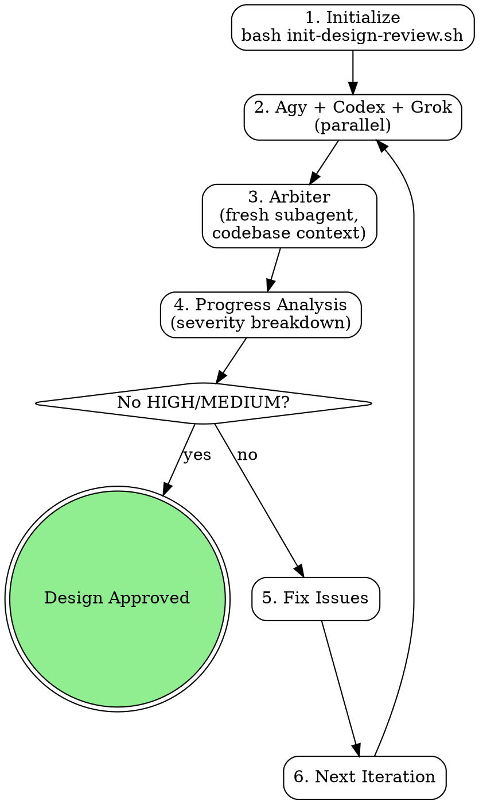

# Blueprint Review (Three-Tier, Fresh Arbiter)

AI-powered design review using Agy + Codex + Grok (parallel) with a **fresh arbiter subagent** as the arbiter (never the plan-authoring session — see Arbiter Dispatch Protocol).

<EXTREMELY-IMPORTANT>
YOU MUST WAIT FOR ALL THREE REVIEWERS BEFORE MARKING PASS.

This is the rule a session once violated on class-roll (2026-03-10): the orchestrator did its own validation, decided PASS with "only low-severity items," and stamped `<!-- design-reviewed: PASS -->` while Agy and Codex were still running in background. This is NEVER acceptable.

DO NOT rationalize skipping reviewers. These thoughts are violations:
- "My validation already PASSED with low-severity items"
- "Agy and Codex are still running, I'll build consensus with what we have"
- "My review is most authoritative since I have codebase context"
- "Two out of three passed, that's probably good enough"
- "I can do my own review instead of waiting for the script"
- "I have the most context — I'll arbitrate inline instead of dispatching the arbiter subagent"

EVERY design review MUST:
1. Run `run-design-review-loop.sh` as a BLOCKING bash call
2. Wait for ALL reviewer outputs (agy.json, codex.json, grok.json, plus claude.json from the arbiter) — grok.json is always written by the loop, even when grok was unavailable (it contains an error-status JSON in that case)
3. Dispatch a FRESH arbiter subagent (see Arbiter Dispatch Protocol) to validate Agy/Codex/Grok findings against the codebase — the session that authored the plan must NOT write claude.json itself
4. Mark PASS ONLY when the arbiter's verdict has no HIGH/MEDIUM issues (confidence >= 0.5)
</EXTREMELY-IMPORTANT>

## Overview

Three-tier model with a fresh arbiter:
1. **Agy + Codex + Grok**: Run in parallel as independent comprehensive reviewers (Grok added 2026-05-26 to extend voice-lineage diversity into design review; falls back to Droid if grok is unavailable, matching the existing reviewer_1/_2 droid-fallback pattern across all three slots)
2. **Arbiter (fresh subagent)**: A freshly dispatched arbiter subagent validates their findings against the codebase. Never the plan-authoring session itself (v3.3; see Arbiter Dispatch Protocol)
3. **The arbiter's verdict**: The sole convergence signal

**Key features:**
- Author/arbiter separation (the session that wrote the plan never judges it — fresh subagent arbiter)
- Parallel execution (Agy + Codex + Grok run simultaneously)
- Run-scoped artifact isolation (stale outputs cleaned per iteration)
- Hard freshness contract (run_id + spec_hash in every output)
- Atomic writes (.pending → rename on success)
- Explicit progress model (severity breakdown, not binary FAIL/PASS)

## When to Use

**Use for:**
- Implementation plans (PLAN.md, roadmaps, feature specs)
- Architecture documents (system designs, API specs, data models)
- Major refactoring plans or structural decisions

**Don't use for:**
- Code review (use litmus instead)
- Documentation review (not technical decisions)
- Already-implemented features (too late)

## Quick Reference

| Component | Focus | Typical Time |
|-----------|-------|--------------|
| Reviewer 1 | Comprehensive (all aspects) | 1-5min |
| Reviewer 2 | Comprehensive (all aspects) | 1-5min |
| Reviewer 3 | Comprehensive (all aspects) | 1-5min |
| Reviewer 1 + 2 + 3 | Parallel execution | 1-5min (wall clock) |
| Arbiter (fresh subagent) | Codebase validation + verdict | 2-5min |

**Completion criteria:** The arbiter's verdict has no plan-blocking HIGH or MEDIUM issues (confidence >= 0.5). TDD-discoverable findings (test stubs, lint, perf) and scope-expansion findings ("OUT OF SCOPE", "follow-up PR") do NOT block convergence — they are deferred to `follow-up-issues.md`.

**Auto-stop on no progress:** Trajectory checks fire starting at iteration 2 for both blocking states. If `plan_blocking_high` fails to strictly decrease while state is `blocked_by_high_issues`, OR if `plan_blocking_medium` fails to strictly decrease while state is `medium_issues_remaining`, the loop accepts the current state as `low_issues_only` rather than grinding to `max_iterations`. The early-stop signal is recorded as `early_stopped: "no_improvement_trajectory"` in the state file. Both `high_issues_history` and `medium_issues_history` track per-iteration counts.

**Default max iterations:** 5. (Briefly lowered to 3 after the v3.1 cascades-11-12 incident; raised back to 5 once MEDIUM-trajectory protection landed in v3.2 — see Version History. The trajectory early-stops are the real circuit breakers; max-iter is just a final cap.)

**Escape hatch:** If the review loop does not converge, the user can create `.opencode/skip-design-review.local` in their terminal to bypass the gate (single-use, 30s self-bypass detection — see orchestrator SKILL.md for protocol).

## Configuration

Reviewer CLIs are configurable via `.opencode/busdriver.json` using the `routes` object:

```json
{
  "routes": {
    "blueprint-review.reviewer_1": ["agy", "droid"],
    "blueprint-review.reviewer_2": ["codex", "droid"],
    "blueprint-review.reviewer_3": ["grok", "droid"]
  }
}
```

All three reviewer slots walk to `droid` as a universal fallback, mirroring the council pattern (pragmatist/critic/researcher all fall to droid). The blueprint-specific risk that two reviewers might both land on droid simultaneously (e.g., agy and grok both missing) is handled by the loop's duplicate detection: reviewer_1 and reviewer_2 collisions enter DUPLICATE_MODE (single-reviewer mode, output copied), and reviewer_3 collisions with either higher slot trigger REVIEWER_3_DUPLICATE which skips the voice.

| Role | Route key | Default |
|------|-----------|---------|
| Reviewer 1 | `blueprint-review.reviewer_1` | agy |
| Reviewer 2 | `blueprint-review.reviewer_2` | codex |
| Reviewer 3 | `blueprint-review.reviewer_3` | grok (added 2026-05-26; falls back to droid if grok not installed, matching reviewer_1/_2 pattern) |
| Arbiter | (hardcoded) | oracle — dispatched as a fresh subagent via the `task` tool with `subagent_type: "oracle"` (not configurable — the arbiter must be a subagent with codebase tools; see Arbiter Dispatch Protocol) |

If reviewer_1 and reviewer_2 resolve to the same CLI, the system runs single-reviewer mode for that pair (one execution, output copied to both paths, logged as degradation). If reviewer_3 collides with reviewer_1 or reviewer_2, the reviewer_3 voice is skipped entirely (no duplicate copy — arbitration proceeds with two voices) to avoid combinatorial 3-way copying for an edge case.

See `.opencode/busdriver.json` for per-role routing configuration.

## Workflow



### 1. Initialize Review

```bash
cd /path/to/project
# BUSDRIVER_PLUGIN_ROOT is set by the plugin loader at session start
bash "${BUSDRIVER_PLUGIN_ROOT}/skills/blueprint-review/scripts/init-design-review.sh" docs/plans/PLAN.md
```

**Creates state file** (`docs/reviews/<slug>/state.md`) tracking:
- Current iteration (1 to max_iterations, default 5)
- Review statuses (Agy, Codex, arbiter)
- Progress model (high/medium/low issue counts)

### 2. Run Review Loop

```bash
bash "${BUSDRIVER_PLUGIN_ROOT}/skills/blueprint-review/scripts/run-design-review-loop.sh"
```

**Automated workflow:**
1. **Clean stale artifacts** from previous iteration
2. **Run Agy + Codex + Grok in parallel** (background processes, `wait` for all)
3. **Validate outputs** (JSON integrity + freshness contract)
4. **Arbiter validation** via fresh subagent (see Arbiter Dispatch Protocol). A pre-written verdict is consumed only via `--claude-only`, and only if its `run_id` AND `spec_hash` match the current reviewer artifacts (ADR 0003 Decision 7) — full-loop iterations always clean `claude.json` and re-arbitrate
5. **Progress analysis** (severity breakdown from the arbiter's verdict)
6. **Convergence check** (no HIGH/MEDIUM with confidence >= 0.5 → PASS)

### 3. Address Issues & Iterate

Update your design document based on the arbiter's findings, then re-run:

```bash
# Edit design file
vim docs/plans/PLAN.md

# Run next iteration
bash "${BUSDRIVER_PLUGIN_ROOT}/skills/blueprint-review/scripts/run-design-review-loop.sh"
```

**Iteration continues until:**
- The arbiter's verdict has no plan-blocking HIGH/MEDIUM issues (confidence >= 0.5)
- OR trajectory auto-stop fires (plan-blocking HIGH or MEDIUM didn't decrease from prior iteration, for whichever severity is currently blocking)
- OR max iterations reached (default: 5)

## Architecture: Fresh Arbiter Model

### Why Not Mechanical Consensus?

The original system used Jaccard keyword similarity to match issues across reviewers.
It achieved **0% match rate** across 5 iterations because reviewers use different naming conventions.
The arbiter's manual cross-referencing was doing all the real consensus work.

**New model:** The arbiter IS the consensus mechanism. Agy and Codex provide independent perspectives;
the arbiter validates them against the codebase and renders a verdict.

### Why a Fresh Subagent (v3.3)?

Until v3.2 the arbiter was the calling session itself — the same session that wrote (or
commissioned) the plan. That is author-as-judge: the arbiter has investment in its own plan
passing, and the class-roll incident (2026-03-10, see the EXTREMELY-IMPORTANT block) showed
the bias is real, not theoretical. The prose prohibitions at the top of this skill suppressed
the bias with willpower; v3.3 removes it structurally. The arbiter is a freshly dispatched
subagent that never saw the plan being written, has no conversation context to defend,
and judges only what is in the prompt file plus the codebase.

The arbiter sharing a model family with the calling session is fine — cross-model diversity
is the reviewers' job (Agy/Codex/Grok); the arbiter's job is codebase validation, not
independent perspective.

No dispatch-contract changes were needed for the arbiter-identity move itself: the loop's
contract has always been "someone writes `claude.json`, then re-run `--claude-only`", and
v3.3 changes WHO writes it. The one script change in v3.3 is separate — the Decision 7
verdict-freshness re-key (see Version History and ADR 0003).

### Arbiter Dispatch Protocol

When the loop script pauses for arbitration (exit code 2 / `awaiting_claude_validation` in
agent mode, or auto-mode's "arbiter validation must be completed by the calling skill"), the
calling session MUST:

1. **Dispatch a fresh arbiter subagent** via the `task` tool:
   - `subagent_type`: `"oracle"` — opencode's highest-reasoning specialist, so arbiter quality does not depend on what the calling session happens to run.
   - Prompt — exactly this fixed template, two absolute paths substituted, nothing more:

     > You are the design-review arbiter. Read the validation prompt at
     > `<absolute path to claude-validation-prompt.txt>` and follow it exactly.
     > Use Read/Grep/Glob to verify every claim against the codebase.
     > Write your strict-JSON verdict to `<absolute path to claude.json>`.
     > Return a one-paragraph summary: status, plus issue counts by severity.

2. **Context firewall.** Do NOT include conversation history, plan-authoring rationale,
   defenses of any design decision, or "the user prefers..." framing in the dispatch prompt.
   The prompt file is self-contained by design (design doc + all three reviews + coverage +
   freshness contract). Anything added beyond the two paths reintroduces the author bias this
   protocol exists to remove.

3. **Post-dispatch check** (calling session, cheap): `claude.json` exists, parses as JSON,
   has `status` of `PASS` or `FAIL`, and `metadata.run_id` matches the current run.
   Then re-run the loop with `--claude-only`. (The script re-validates fully — this check just
   avoids burning a loop invocation on a garbage file.)

4. **Failure handling (fail-closed):**
   - If the subagent fails or writes invalid JSON, delete the bad `claude.json` and dispatch
     ONE fresh retry. If the retry also fails, STOP and report to the user — do NOT silently
     arbitrate inline. Inline arbitration by the calling session is permitted only when the
     user explicitly authorizes it after being told the dispatch failed twice, and the
     degradation must be recorded in the verdict's `validation_notes`
     (`arbiter=inline (degraded, user-authorized)` — consistent here, since in this sole
     case the calling session is the writer).

### Freshness Contract

Every reviewer output includes metadata for provenance tracking:

```json
{
  "metadata": {
    "run_id": "a1b2c3d4",
    "iteration": 2,
    "spec_hash": "sha256-of-design-file",
    "review_duration_ms": 120000
  }
}
```

The script validates that all outputs share the same `run_id` before proceeding.
Stale outputs from previous runs are rejected (fail-closed).

### Progress Model

Replaces binary FAIL/PASS with explicit severity breakdown. **Counts are category-aware** — only "plan-blocking" findings count toward convergence:

| Status | Meaning | Action |
|--------|---------|--------|
| `blocked_by_high_issues` | Plan-blocking HIGH issues remain | Must fix before proceeding |
| `medium_issues_remaining` | Plan-blocking MEDIUM issues remain | Should fix before proceeding |
| `low_issues_only` | Only LOW or deferred issues | PASS — proceed to implementation |
| `passed` | No issues | PASS — proceed to implementation |

**Plan-blocking vs. deferred:**
- **Plan-blocking categories** (block convergence): `architecture`, `clarity`, `completeness`, `security`, `design`, `correctness`, and any other category not listed below.
- **TDD-discoverable categories** (deferred to TDD): `technical-accuracy`, `bugs`, `implementation`, `best-practices`, `maintainability`, `performance`. These are line-level concerns the first test run catches in seconds — flagging them at plan-review time is noise.
- **Scope-expansion findings** (deferred to follow-up): any finding whose `suggestion` field contains `OUT OF SCOPE`, `follow-up PR`, `deferred to follow-up`, `post-merge`, or `inherited from parent`. These represent legitimate concerns belonging to a different PR.

Deferred findings are written to `docs/reviews/<slug>/follow-up-issues.md` so the user can address them during implementation or open a follow-up issue.

Progress is visible across iterations: "iter1: 4 plan-blocking high → iter2: 3 → iter3: 1, auto-stop". The `high_issues_history` and `medium_issues_history` fields in `state.md` track per-iteration trajectories for each severity.

## Arbiter Validation

**The arbiter's unique role** (runs in a fresh subagent — see Arbiter Dispatch Protocol):

- Full codebase context (can read existing code)
- Validates Agy/Codex claims against reality
- Identifies gaps in their coverage
- Renders the final verdict
- No authorship stake — it never saw the plan being written

**Validation types:**
- `confirms_agy`: Agrees with Agy finding
- `confirms_codex`: Agrees with Codex finding
- `new_finding`: Found issue they missed
- `contradicts_agy`: Disagrees with Agy
- `contradicts_codex`: Disagrees with Codex

## Output Format

**Review JSON schema:**

```json
{
  "status": "PASS"|"FAIL",
  "reviewer_id": "agy|codex|grok|claude",
  "reviewer": "agy|codex|grok|claude",
  "review_duration_ms": 0,
  "issues": [
    {
      "section": "Section name or line reference",
      "severity": "high|medium|low",
      "confidence": 0.0-1.0,
      "category": "clarity|completeness|architecture|...",
      "description": "Clear, specific description",
      "suggestion": "Actionable fix",
      "reviewer": "agy|codex|grok|claude"
    }
  ],
  "metadata": {
    "run_id": "a1b2c3d4",
    "iteration": 1,
    "spec_hash": "sha256...",
    "total_sections_reviewed": 0,
    "review_timestamp": "ISO-8601",
    "codebase_files_examined": []
  }
}
```

**Status rules:**
- `FAIL`: Any high/medium severity with confidence >= 0.5
- `PASS`: Only low severity OR low confidence (<0.5) issues

## Error Handling

Reviewer outputs MUST be validated before arbiter validation. Malformed or error JSON treated as implicit PASS is a critical bypass.

**Validation rules:**
1. Each reviewer JSON MUST contain a `"status"` field with value `"PASS"` or `"FAIL"`
2. Each reviewer JSON MUST contain a `"reviewer_id"` field
3. If a reviewer JSON contains an `"error"` key, treat as `"status": "FAIL"`
4. If a reviewer JSON fails to parse, treat as `"status": "FAIL"`
5. If a reviewer file is missing after timeout, treat as `"status": "FAIL"` — never skip
6. If `run_id` doesn't match current run, treat as stale — reject (fail-closed)

## Common Mistakes

| Mistake | Fix |
|---------|-----|
| Show partial results before all reviews complete | Wait for all three outputs, then proceed |
| Skip arbiter validation | The arbiter is the convergence signal — skipping it removes the consensus mechanism |
| Arbitrate inline in the plan-authoring session | Dispatch a fresh arbiter subagent — author-as-judge bias is the class-roll failure mode |
| Paste conversation context into the arbiter dispatch prompt | Two paths only (prompt file + output file) — the prompt file is self-contained by design |
| Trust external reviews blindly | The arbiter validates claims against the codebase |
| Ignore iteration limits | Max 5 iterations prevents infinite loops |
| Accept error JSON as valid review | Validate `status` field; `error` key → synthetic FAIL |
| Read stale outputs from previous run | Script cleans artifacts at iteration start + validates run_id |

## Troubleshooting

**Issue: Agy or Codex CLI not found**

```bash
which agy
which codex
```

If not installed, the workflow uses error fallback. Install CLIs for full review coverage.

**Issue: Arbiter validation is slow**

The arbiter subagent needs codebase access for validation. In auto mode, the calling skill dispatches the arbiter subagent and must wait for it to write `claude.json` before re-running with `--claude-only`.

**Issue: Iteration loop doesn't converge**

- Check progress in state file: `cat docs/reviews/<slug>/state.md` — look at `high_issues_history` and `medium_issues_history` for the trajectories.
- If the trajectory for the currently-blocking severity is flat or oscillating, the auto-stop fires after iteration 2 and accepts current state as `low_issues_only`.
- If `early_stopped: "no_improvement_trajectory"` appears in state, the loop exited early because adding detail to the plan was creating new findings (asymptote chasing).
- Check `follow-up-issues.md` — many findings may have been deferred there, leaving fewer plan-blocking issues than the raw HIGH/MEDIUM totals suggest.
- If stuck despite all that, break design into smaller pieces.
- Max iterations (default: 5) prevents infinite loops.

**Issue: Stale output detected**

The script validates `run_id` on every output. If you see "STALE OUTPUT DETECTED", a file from a previous run was not cleaned up. The script handles this automatically by replacing with an error JSON.

## State Files

Each design file gets its own review directory: `docs/reviews/<slug>/`

Active review tracked by pointer file: `.opencode/current-design-review.local`

- `docs/reviews/<slug>/state.md` - YAML frontmatter tracking iteration + progress
- `docs/reviews/<slug>/agy.json` - Agy review output (with freshness metadata)
- `docs/reviews/<slug>/codex.json` - Codex review output (with freshness metadata)
- `docs/reviews/<slug>/grok.json` - Reviewer_3 output (with freshness metadata; absent only when reviewer_3 is intentionally skipped, e.g., duplicate-collision skip or explicit `none`; present with error-status JSON when grok is unavailable)
- `docs/reviews/<slug>/claude.json` - Arbiter output (with freshness metadata)
- `docs/reviews/<slug>/claude-validation-prompt.txt` - Generated prompt for the arbiter

**Clean up after completion:**

```bash
rm -rf docs/reviews/<slug>/
```

## Coverage Provenance

Records WHICH reviewer slots actually ran vs silently fell back, so a degraded run is never counted as "3 reviewers ran". See `docs/plans/DESIGN-blueprint-review-coverage-provenance.md`.

**Per-review state** (`state.md` frontmatter): `coverage_status` (FULL|DEGRADED), `fulfilled_lens_count` (0–3), and per slot `reviewer_N_requested` / `reviewer_N_actual` / `reviewer_N_fulfilled` / `reviewer_N_reason`; `coverage_history` tracks the fulfilled count per iteration. A slot is FULFILLED only if it produced a valid PASS/FAIL with a matching `run_id` and did not fall back to droid / collapse to a duplicate / return empty / error. (An empty `issues` array with `status: PASS` is a clean review → fulfilled — fulfillment keys on execution status, never on issue count.)

**Surfaced, never silent:** the arbiter prompt receives a `## Coverage` section (UNFULFILLED slots must not be counted as independent agreement); on convergence a `COVERAGE: FULL|DEGRADED N/3` line is logged and a durable `<!-- design-review-coverage: ... -->` marker is upserted into the reviewed doc next to `design-reviewed: PASS`.

**Cross-review trend:** each completed review appends one JSONL line to `.opencode/blueprint-coverage-trend.local` (gitignored). At init, if the last `BLUEPRINT_COVERAGE_MIN_STREAK` (default 3) reviews were all DEGRADED, a loud but **non-blocking** advisory fires and `.opencode/blueprint-coverage-degraded.local` is written — auto-cleared on a later FULL run or via `BLUEPRINT_ACK_DEGRADED=1`.

| Env var | Default | Effect |
|---------|---------|--------|
| `BLUEPRINT_COVERAGE_PROVENANCE` | `1` | `0`/`false` disables all coverage tracking (existing flow unchanged) |
| `BLUEPRINT_COVERAGE_MIN_STREAK` | `3` | consecutive DEGRADED reviews before the chronic advisory |
| `BLUEPRINT_ACK_DEGRADED` | — | `1` dismisses the chronic advisory |

## Confidence Scoring Guidelines

| Range | Meaning | Criteria |
|-------|---------|----------|
| 0.9-1.0 | Certain | Clear violation with cited evidence |
| 0.7-0.9 | Very likely | Strong evidence but some ambiguity |
| 0.5-0.7 | Probable | Moderate evidence, could be design choice |
| 0.3-0.5 | Uncertain | Weak evidence, needs clarification |
| 0.0-0.3 | Speculative | No strong evidence, just a concern |

### Display Rules

When presenting findings to the user, filter by confidence tier:

| Confidence | Display |
|------------|---------|
| 0.7 to 1.0 | Show normally in main report |
| 0.5 to <0.7 | Show with caveat: "*Medium confidence — verify this is actually an issue*" |
| 0.3 to <0.5 | Suppress from main report. Include in appendix section: "Low-confidence findings (may be false positives)" |
| 0.0 to <0.3 | Suppress entirely unless severity is `high` |

**Important:** Low-confidence findings are suppressed from the user-facing report only. They remain in the JSON artifacts (`agy.json`, `codex.json`, `grok.json`, `claude.json`) for auditability. Never delete findings from stored outputs.

### Calibration-to-Instinct Bridge

When the user confirms a low-confidence finding (0.3-0.5) was a real issue, this is a calibration event — the reviewer's initial confidence was too low. Log the corrected pattern so future reviews catch it with higher confidence:

Write to `~/.opencode/notes/lesson-review-cal-{YYYY-MM-DD}-{slug}.md`. If the path already exists, append `-2`, `-3`, etc. to the slug before writing, and use the same suffixed filename in the NOTES.md pointer below.

```markdown
---
name: review-cal-{actual-slug}
description: Blueprint review underconfident on {pattern} — was {original_confidence}, should be {corrected_confidence}
type: feedback
last_validated: "{YYYY-MM-DD}"
---

**Pattern:** {what the finding was about}
**Original confidence:** {0.X} | **Correct confidence:** {0.X+0.2 or higher}
**Why underconfident:** {why the reviewer didn't see stronger evidence}
**How to apply:** When reviewing {similar patterns}, start at confidence {corrected} instead of {original}
```

After writing the file, add a one-line pointer to `~/.opencode/notes/NOTES.md` using the actual filename written (including any `-2`, `-3` suffix):
```
- [Review calibration: {slug}](./lesson-review-cal-{YYYY-MM-DD}-{actual-slug}.md) — {pattern} confidence corrected {old} → {new}
```

**Solicitation:** When the design review report includes an appendix of low-confidence findings, end the report with: "**Calibration check:** Were any of the appendix findings above actually real issues? If so, I'll log the corrected confidence for future reviews."

This bridges design review findings into the instinct/lesson system, compounding review quality over time.

## User-Created Skip File

This section is the **canonical protocol** for the user-created skip files across the four busdriver gates (which use three distinct files: `skip-design-review.local`, `skip-litmus.local` shared between pre-commit and pre-PR, and `skip-pr-grind.local`). The protocol (verbatim message template, Monitor wait pattern, hard rules) is identical across gates; only the file path, triggering command, and a few mechanical details differ. `litmus/SKILL.md` and `pr-grind/SKILL.md` both point here.

### Per-gate differences

| Gate | Skip file | Trigger | <30s rejection | Freshness | Tool-call fragility |
|------|-----------|---------|----------------|-----------|---------------------|
| **Pre-implementation (design review)** | `.opencode/skip-design-review.local` | Write/Edit/MultiEdit/Bash while design unreviewed | gate deletes file | unbounded | **High** — gate fires on any of those tool calls, so any intervening Bash (incl. `test -f`/`ls`/`stat`) destroys the file |
| **Pre-commit (litmus)** | `.opencode/skip-litmus.local` | `git commit` | gate **preserves** file (ages naturally) | unbounded | Low — gate only fires on `git commit` |
| **Pre-PR (litmus)** | `.opencode/skip-litmus.local` (same file as pre-commit) | `gh pr create` | gate deletes file (re-touch required) | unbounded | Low — gate only fires on `gh pr create` |
| **Pre-merge (pr-grind)** \* | `.opencode/skip-pr-grind.local` | `gh pr merge` | gate deletes file | **30s..3600s** — files ≥1h old silently deleted | Low — gate only fires on `gh pr merge` |

\* The `<30s rejection` cell behaves as documented (eager delete). The **gate-pass (≥30s) path** is what differs: deletion is **deferred to PostToolUse confirmation** so a failed `gh pr merge` does NOT consume the bypass token. See the deferred-consumption note immediately below.

> **Pre-merge uses deferred consumption** (unique among the four gates). The PreToolUse gate records the claim in `.opencode/.merge-bypass-pending.local` and leaves the skip file alone. The PostToolUse hook (`post-merge-confirm-bypass.sh`) deletes the skip file only on confirmed `gh pr merge` success. On merge failure, `--auto` queued-but-not-yet-merged, ambiguous output, tampered mtime, or cross-PR mismatch, the skip file is preserved so the operator can retry without a re-touch. See README "Event types written to bypass-log.jsonl" for the full event taxonomy (`skip-pr-grind-claimed`, `-consumed`, `-released`, `-released-auto-queued`, `-released-ambiguous`, `-released-tampered`, `-released-mismatch`, `-released-malformed`).

The remainder of this section (verbatim message template, Monitor wait, hard rules) applies to **all four gates** unless explicitly noted.

### Design-review specifics (this skill's gate)

When the user wants to bypass design review (e.g., plan already validated out-of-band, or the review is blocking legitimate exploration), they create `.opencode/skip-design-review.local` manually in their terminal. The skip file is consumed by the **pre-implementation gate only** (it does not bypass the pre-commit or pre-PR gates). The gate has a **30-second timing heuristic** that rejects and deletes skip files created "moments ago" to prevent the orchestrator from self-bypassing.

**How the skip-file check behaves on every tool call the gate sees while design review is pending:**
1. If `.opencode/skip-design-review.local` exists and is **<30s old** → gate deletes it and blocks (treated as self-bypass).
2. If the file exists and is **≥30s old** → gate deletes it (single-use) and allows the blocked action through.
3. If no file → gate falls through to its normal allow/block rules (Write/Edit of implementation code → block; file-modifying Bash → block; SAFE tool uses → allow).

Critically, the skip-file check in steps 1–2 runs **before** tool-type discrimination — so any tool call that reaches the gate while a skip file exists will consume it, even ostensibly "harmless" Bash like `test -f`, `ls`, or `stat` on the skip file itself. Verification counts. Polling counts. If the orchestrator fires any tool call during the <30s window, the file is destroyed and must be re-created.

### Verbatim message template (required)

When the orchestrator needs a skip file, it must emit this exact message, with two substitutions:
- `<PROJECT_ROOT>` → the absolute path of the current git repo root (from `git rev-parse --show-toplevel` — not the CWD of the session, which may be a subdirectory or worktree).
- `<GATE>` → one of: `design-review`, `litmus`, `pr-grind` (matches the row in the per-gate-differences table above).

> I need a skip file to bypass the `<GATE>` gate. Please run this in **your terminal** (not in this session):
>
> ```
> touch <PROJECT_ROOT>/.opencode/skip-<GATE>.local
> ```
>
> After you run it, I will wait ~35 seconds before retrying the blocked action. Please reply "done" once you've run the command. Do not expect an immediate response from me — the wait is required by the gate and is not a stall.

For pr-grind, also tell the user "the file must be touched within the last hour — the gate rejects ages of 3600s or more" so they don't sit on it indefinitely (other gates have unbounded freshness).

Do not give the relative path (`.opencode/skip-<GATE>.local`) — gates check `.opencode/` relative to the **blocked command's CWD**, which may differ from the user's terminal CWD, and users routinely run `touch` from a different pane.

### After the user confirms ("done")

Wait ~35 seconds without executing any tool that touches the filesystem, then retry the originally blocked action directly.

```
Monitor(command: "sleep 35 && echo READY", timeout: 45)
# When Monitor emits READY (or completes), retry the blocked Edit/Write/Bash.
# Do NOT verify the skip file first — the verification itself consumes it.
```

`Monitor`'s subprocess sleeps atomically and does not re-enter the PreToolUse hook, so the skip file survives the wait. A direct `sleep 35` via Bash is blocked by the harness (long foreground sleeps are rejected), and polling loops that call `stat`/`test`/`ls` will destroy the file.

### Hard rules

- **NEVER create the skip file yourself** — the gate will detect self-bypass, delete the file, and log an audit event.
- **NEVER verify the skip file via Bash** (`test -f`, `ls`, `stat`, `cat`, `find`). The reasoning differs by gate, but the rule is the same in all cases:
   - **Pre-implementation (design-review)** — verification is **destructive**. The gate fires on every Write/Edit/MultiEdit/Bash call, so any intervening Bash during the <30s self-bypass window consumes the file (the gate's skip-file age check runs before tool-type discrimination).
   - **Pre-commit / Pre-PR (litmus) and Pre-merge (pr-grind)** — verification is **pointless** (not destructive). Those gates short-circuit unless the Bash command matches their trigger (`git commit`, `gh pr create`, `gh pr merge`), so `test -f` never reaches the skip-file logic — but it also tells you nothing useful and only wastes the wait budget.

   In all cases: don't verify, trust the user's "done" confirmation, and retry the originally blocked action directly.
- **NEVER ask the user to wait** — the orchestrator does the wait via `Monitor`.
- **Use `Monitor(command: "sleep 35 && echo READY")`**, not `sleep 32` directly.
- **Single-use** — the skip file is consumed after one bypass. If more writes are needed, the user must `touch` it again and the orchestrator must wait another 35s.
- **Audit trail** — every consumption is logged to `.opencode/bypass-log.jsonl`.
- **If the file gets rejected-and-deleted** (e.g., the orchestrator fat-fingered a tool call during the window), ask the user to `touch` it again and start the wait over.

## Version History

> **Port note (2026-06):** This skill was ported from Claude Code to opencode format. The version history below documents the original Claude Code feature evolution. In the opencode port, the arbiter is dispatched via `task(subagent_type="oracle")` instead of Claude subagent/model pinning; the gateway-fallback rung (v3.4) is replaced by the native `task` tool dispatch. See Arbiter Dispatch Protocol for opencode-specific dispatch mechanics.

**v3.4.2 (2026-06-17):** Neutralize inherited operator permission scopes in the gateway rung (issue #198). The four-layer containment of v3.4.1 confined `Edit` to the verdict file via a scoped `--allowedTools` + `--permission-mode dontAsk`, but `--settings` *merges* with the operator's user/project/local settings and `permissions.allow` arrays *concatenate* — so an operator who had once approved a broad `Edit` (e.g. `Edit(//**)`) inherited it into the arbiter run, letting a prompt-injected arbiter Edit arbitrary workspace files despite `dontAsk` (which still honours pre-approved tools). The dispatch now also passes **`--setting-sources ''`** so none of the operator's user/project/local scopes load; the gateway credential is unaffected (it arrives via the independent `--settings` file). A **capability guard** probes the CLI under the same `env` scrubbing as the dispatch, before any credential is written — and fails the dispatch **closed** if the local binary predates `--setting-sources` (the caller retries once, then falls through to the `opus` rung) rather than running unconfined. +3 test assertions. *(Not applicable in the opencode port — the `task` tool handles dispatch internally.)*

**v3.4.1 (2026-06-13):** Gateway rung made to actually work against a live gateway (the v3.4 rung shipped tested only against a stub, so two real-binary failures were latent). (1) Endpoint precedence: settings file `env` overrode per-process env, clobbering gateway endpoint and potentially shipping operator secrets. Fixed by routing gateway endpoint + credential through a CLI `--settings` file (0600 temp file). (2) Tool names under `--bare`: the selectable built-in set collapsed to `Read` alone when passing unsupported tools. Fixed with `Read,Edit` + pre-created placeholder. *(Not applicable in the opencode port.)*

**v3.4 (2026-06-12):** Gateway-fallback arbiter rung. Inserted a sub-rung between subscription `fable` and subscription `opus` in the unsupported-model fallback chain: when `fable` is gone from the calling session's plan but the operator has configured gateway credentials, the arbiter is dispatched through the gateway, preserving fable-quality arbitration. The rung is opt-in via `BLUEPRINT_ARBITER_GATEWAY_*` env vars. *(In the opencode port, this is replaced by the native `task(subagent_type="oracle")` dispatch — see Arbiter Dispatch Protocol.)*

**v3.3 (2026-06-10; fallback chain added 2026-06-11):** Fresh-subagent arbiter. Arbitration moved from the calling session (author-as-judge) to a freshly dispatched subagent pinned to highest-reasoning tier, with a context firewall (fixed template + two file paths only) and a model fallback chain so a renamed/retired tier degrades gracefully. Structurally removes the class-roll-style self-pass bias **for the compliant path** (the verdict-renderer has no authorship stake); protocol compliance itself remains prose-enforced defense-in-depth. The loop's `claude.json` contract is unchanged — only who writes the file. Includes the ADR 0003 Decision 7 script change (landed same day): verdict freshness re-keyed from design `spec_hash` alone to current-run `run_id` + `spec_hash`. See ADR 0003.

**v3.2 (2026-05-25):** MEDIUM-trajectory tracking + early-stop. Added `medium_issues_history` field and a parallel trajectory check that fires when `progress_status == medium_issues_remaining`. Previously the trajectory check only watched HIGH, leaving MEDIUM-only states with no circuit breaker — they always ground to `max_iterations` (observed in growth-engine task-13-content-audit, iter 3/3, history `[2,0]` with 3 unresolved MEDIUMs). Default `max_iterations` raised 3 → 5 now that both severities have trajectory protection; the v3.1 bimodal-convergence hypothesis didn't account for slow MEDIUM convergence with HIGH already resolved.

**v3.1 (2026-04-29):** Category-aware convergence. Plan-blocking vs. TDD-discoverable category split. Scope-expansion findings auto-deferred to `follow-up-issues.md`. Trajectory-aware early-stop after 2 iterations of no improvement (HIGH only). Default `max_iterations` reduced from 5 to 3 (later reverted in v3.2). Arbiter `validation_notes` surfaced in user output.

**v3 (2026-03-27):** Arbiter-as-consensus model (originally Claude Code-based). Parallel Agy+Codex. Run-scoped isolation. Freshness contracts. Atomic writes. Explicit progress model. Deleted broken Jaccard consensus, auto-fix engine, and report generator.

**v2:** Three-tier with Jaccard consensus + auto-fix. Achieved 0% consensus match rate. The orchestrator's manual cross-referencing did all real work.

**v1:** Agy (strategic) + Codex (technical) with manual triage.
