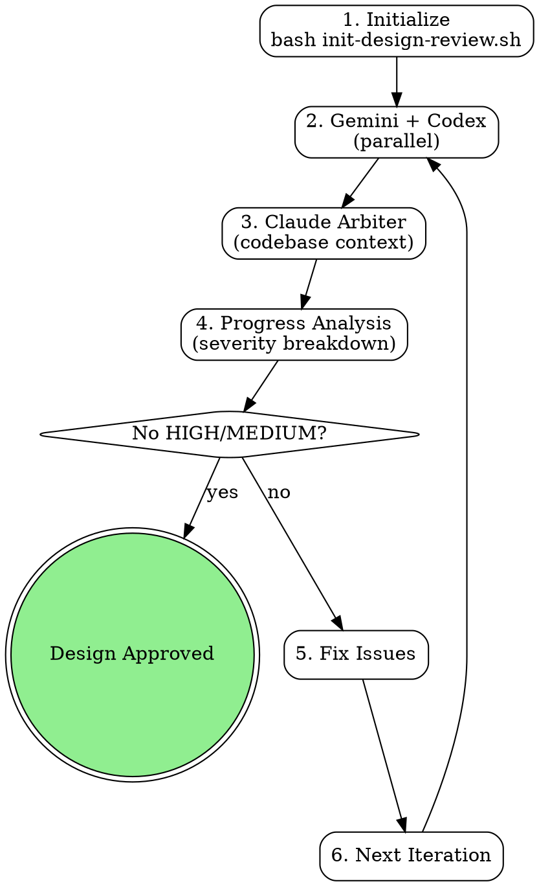

# Blueprint Review (Three-Tier, Claude Arbiter)

AI-powered design review using Gemini + Codex (parallel) with Claude as the arbiter.

<EXTREMELY-IMPORTANT>
YOU MUST WAIT FOR ALL THREE REVIEWERS BEFORE MARKING PASS.

This is the rule Claude violated on class-roll (2026-03-10): Claude did its own validation, decided PASS with "only low-severity items," and stamped `<!-- design-reviewed: PASS -->` while Gemini and Codex were still running in background. This is NEVER acceptable.

DO NOT rationalize skipping reviewers. These thoughts are violations:
- "Claude validation already PASSED with low-severity items"
- "Gemini and Codex are still running, I'll build consensus with what we have"
- "The Claude review is most authoritative since it has codebase context"
- "Two out of three passed, that's probably good enough"
- "I can do my own review instead of waiting for the script"

EVERY design review MUST:
1. Run `run-design-review-loop.sh` as a BLOCKING bash call
2. Wait for ALL THREE reviewer outputs (gemini.json, codex.json, claude.json)
3. Claude validates Gemini/Codex findings against the codebase
4. Mark PASS ONLY when Claude's verdict has no HIGH/MEDIUM issues (confidence >= 0.5)
</EXTREMELY-IMPORTANT>

## Overview

Three-tier model with Claude as arbiter:
1. **Gemini + Codex**: Run in parallel as independent comprehensive reviewers
2. **Claude**: Validates their findings against the codebase (arbiter)
3. **Claude's verdict**: The sole convergence signal

**Key features:**
- Parallel execution (Gemini + Codex run simultaneously)
- Run-scoped artifact isolation (stale outputs cleaned per iteration)
- Hard freshness contract (run_id + spec_hash in every output)
- Atomic writes (.pending → rename on success)
- Explicit progress model (severity breakdown, not binary FAIL/PASS)

## When to Use

**Use for:**
- Implementation plans (PLAN.md, roadmaps, feature specs)
- Architecture documents (system designs, API specs, data models)
- Major refactoring plans or structural decisions

**Don't use for:**
- Code review (use litmus instead)
- Documentation review (not technical decisions)
- Already-implemented features (too late)

## Quick Reference

| Component | Focus | Typical Time |
|-----------|-------|--------------|
| Reviewer 1 | Comprehensive (all aspects) | 1-5min |
| Reviewer 2 | Comprehensive (all aspects) | 1-5min |
| Reviewer 1 + 2 | Parallel execution | 1-5min (wall clock) |
| Claude | Arbiter + codebase validation | 2-5min |

**Completion criteria:** Claude's verdict has no plan-blocking HIGH or MEDIUM issues (confidence >= 0.5). TDD-discoverable findings (test stubs, lint, perf) and scope-expansion findings ("OUT OF SCOPE", "follow-up PR") do NOT block convergence — they are deferred to `follow-up-issues.md`.

**Auto-stop on no progress:** If plan-blocking HIGH count fails to strictly decrease from one iteration to the next, the loop accepts the current state as `low_issues_only` rather than grinding to `max_iterations`. The check fires starting at iteration 2 (when there are 2 history entries to compare). The early-stop signal is recorded as `early_stopped: "no_improvement_trajectory"` in the state file.

**Default max iterations:** 3 (was 5 — empirical data showed bimodal convergence: pass at iter 1 or never converge; iterating beyond 3 wasted hours without improving outcomes).

**Escape hatch:** If the review loop does not converge, the user can create `.claude/skip-design-review.local` in their terminal to bypass the gate (single-use, 30s self-bypass detection — see orchestrator SKILL.md for protocol).

## Configuration

Reviewer CLIs are configurable via `.claude/busdriver.json` using the `routes` object:

```json
{
  "routes": {
    "blueprint-review.reviewer_1": ["gemini"],
    "blueprint-review.reviewer_2": ["codex"]
  }
}
```

| Role | Route key | Default |
|------|-----------|---------|
| Reviewer 1 | `blueprint-review.reviewer_1` | gemini |
| Reviewer 2 | `blueprint-review.reviewer_2` | codex |
| Arbiter | (hardcoded) | claude (not configurable — Claude is always the arbiter) |

If both reviewers resolve to the same CLI, the system runs single-reviewer mode (one execution, output copied to both paths, logged as degradation).

See `.claude/busdriver.json` for per-role routing configuration.

## Workflow



### 1. Initialize Review

```bash
cd /path/to/project
# CLAUDE_PLUGIN_ROOT is set by the plugin loader at session start
bash "${CLAUDE_PLUGIN_ROOT}/skills/blueprint-review/scripts/init-design-review.sh" docs/plans/PLAN.md
```

**Creates state file** (`docs/reviews/<slug>/state.md`) tracking:
- Current iteration (1 to max_iterations, default 3)
- Review statuses (Gemini, Codex, Claude)
- Progress model (high/medium/low issue counts)

### 2. Run Review Loop

```bash
bash "${CLAUDE_PLUGIN_ROOT}/skills/blueprint-review/scripts/run-design-review-loop.sh"
```

**Automated workflow:**
1. **Clean stale artifacts** from previous iteration
2. **Run Gemini + Codex in parallel** (background processes, `wait` for both)
3. **Validate outputs** (JSON integrity + freshness contract)
4. **Claude validation** with codebase access (manual step or pre-existing output)
5. **Progress analysis** (severity breakdown from Claude's verdict)
6. **Convergence check** (no HIGH/MEDIUM with confidence >= 0.5 → PASS)

### 3. Address Issues & Iterate

Update your design document based on Claude's findings, then re-run:

```bash
# Edit design file
vim docs/plans/PLAN.md

# Run next iteration
bash "${CLAUDE_PLUGIN_ROOT}/skills/blueprint-review/scripts/run-design-review-loop.sh"
```

**Iteration continues until:**
- Claude's verdict has no plan-blocking HIGH/MEDIUM issues (confidence >= 0.5)
- OR trajectory auto-stop fires (HIGH didn't decrease from prior iteration)
- OR max iterations reached (default: 3)

## Architecture: Claude as Arbiter

### Why Not Mechanical Consensus?

The original system used Jaccard keyword similarity to match issues across reviewers.
It achieved **0% match rate** across 5 iterations because reviewers use different naming conventions.
Claude's manual cross-referencing was doing all the real consensus work.

**New model:** Claude IS the consensus mechanism. Gemini and Codex provide independent perspectives;
Claude validates them against the codebase and renders a verdict.

### Freshness Contract

Every reviewer output includes metadata for provenance tracking:

```json
{
  "metadata": {
    "run_id": "a1b2c3d4",
    "iteration": 2,
    "spec_hash": "sha256-of-design-file",
    "review_duration_ms": 120000
  }
}
```

The script validates that all outputs share the same `run_id` before proceeding.
Stale outputs from previous runs are rejected (fail-closed).

### Progress Model

Replaces binary FAIL/PASS with explicit severity breakdown. **Counts are category-aware** — only "plan-blocking" findings count toward convergence:

| Status | Meaning | Action |
|--------|---------|--------|
| `blocked_by_high_issues` | Plan-blocking HIGH issues remain | Must fix before proceeding |
| `medium_issues_remaining` | Plan-blocking MEDIUM issues remain | Should fix before proceeding |
| `low_issues_only` | Only LOW or deferred issues | PASS — proceed to implementation |
| `passed` | No issues | PASS — proceed to implementation |

**Plan-blocking vs. deferred:**
- **Plan-blocking categories** (block convergence): `architecture`, `clarity`, `completeness`, `security`, `design`, `correctness`, and any other category not listed below.
- **TDD-discoverable categories** (deferred to TDD): `technical-accuracy`, `bugs`, `implementation`, `best-practices`, `maintainability`, `performance`. These are line-level concerns the first test run catches in seconds — flagging them at plan-review time is noise.
- **Scope-expansion findings** (deferred to follow-up): any finding whose `suggestion` field contains `OUT OF SCOPE`, `follow-up PR`, `deferred to follow-up`, `post-merge`, or `inherited from parent`. These represent legitimate concerns belonging to a different PR.

Deferred findings are written to `docs/reviews/<slug>/follow-up-issues.md` so the user can address them during implementation or open a follow-up issue.

Progress is visible across iterations: "iter1: 4 plan-blocking high → iter2: 3 → iter3: 1, auto-stop". The `high_issues_history` field in `state.md` tracks the trajectory.

## Claude Validation

**Claude's unique role as arbiter:**

- Full codebase context (can read existing code)
- Validates Gemini/Codex claims against reality
- Identifies gaps in their coverage
- Renders the final verdict

**Validation types:**
- `confirms_gemini`: Agrees with Gemini finding
- `confirms_codex`: Agrees with Codex finding
- `new_finding`: Found issue they missed
- `contradicts_gemini`: Disagrees with Gemini
- `contradicts_codex`: Disagrees with Codex

## Output Format

**Review JSON schema:**

```json
{
  "status": "PASS"|"FAIL",
  "reviewer_id": "gemini|codex|claude",
  "review_duration_ms": 0,
  "issues": [
    {
      "section": "Section name or line reference",
      "severity": "high|medium|low",
      "confidence": 0.0-1.0,
      "category": "clarity|completeness|architecture|...",
      "description": "Clear, specific description",
      "suggestion": "Actionable fix",
      "reviewer": "gemini|codex|claude"
    }
  ],
  "metadata": {
    "run_id": "a1b2c3d4",
    "iteration": 1,
    "spec_hash": "sha256...",
    "total_sections_reviewed": 0,
    "review_timestamp": "ISO-8601",
    "codebase_files_examined": []
  }
}
```

**Status rules:**
- `FAIL`: Any high/medium severity with confidence >= 0.5
- `PASS`: Only low severity OR low confidence (<0.5) issues

## Error Handling

Reviewer outputs MUST be validated before Claude arbitration. Malformed or error JSON treated as implicit PASS is a critical bypass.

**Validation rules:**
1. Each reviewer JSON MUST contain a `"status"` field with value `"PASS"` or `"FAIL"`
2. Each reviewer JSON MUST contain a `"reviewer_id"` field
3. If a reviewer JSON contains an `"error"` key, treat as `"status": "FAIL"`
4. If a reviewer JSON fails to parse, treat as `"status": "FAIL"`
5. If a reviewer file is missing after timeout, treat as `"status": "FAIL"` — never skip
6. If `run_id` doesn't match current run, treat as stale — reject (fail-closed)

## Common Mistakes

| Mistake | Fix |
|---------|-----|
| Show partial results before all reviews complete | Wait for all three outputs, then proceed |
| Skip Claude validation | Claude is the arbiter — skipping it removes the convergence signal |
| Trust external reviews blindly | Claude validates claims against the codebase |
| Ignore iteration limits | Max 5 iterations prevents infinite loops |
| Accept error JSON as valid review | Validate `status` field; `error` key → synthetic FAIL |
| Read stale outputs from previous run | Script cleans artifacts at iteration start + validates run_id |

## Troubleshooting

**Issue: Gemini or Codex CLI not found**

```bash
which gemini
which codex
```

If not installed, the workflow uses error fallback. Install CLIs for full review coverage.

**Issue: Claude validation is slow**

Claude needs codebase access for validation. In auto mode, the calling skill must complete Claude validation before the script checks for output.

**Issue: Iteration loop doesn't converge**

- Check progress in state file: `cat docs/reviews/<slug>/state.md` — look at `high_issues_history` for the trajectory.
- If trajectory is flat or oscillating, the auto-stop will fire after iteration 2 and accept current state as `low_issues_only`.
- If `early_stopped: "no_improvement_trajectory"` appears in state, the loop exited early because adding detail to the plan was creating new findings (asymptote chasing).
- Check `follow-up-issues.md` — many findings may have been deferred there, leaving fewer plan-blocking issues than the raw HIGH/MEDIUM totals suggest.
- If stuck despite all that, break design into smaller pieces.
- Max iterations (default: 3) prevents infinite loops.

**Issue: Stale output detected**

The script validates `run_id` on every output. If you see "STALE OUTPUT DETECTED", a file from a previous run was not cleaned up. The script handles this automatically by replacing with an error JSON.

## State Files

Each design file gets its own review directory: `docs/reviews/<slug>/`

Active review tracked by pointer file: `.claude/current-design-review.local`

- `docs/reviews/<slug>/state.md` - YAML frontmatter tracking iteration + progress
- `docs/reviews/<slug>/gemini.json` - Gemini review output (with freshness metadata)
- `docs/reviews/<slug>/codex.json` - Codex review output (with freshness metadata)
- `docs/reviews/<slug>/claude.json` - Claude arbiter output (with freshness metadata)
- `docs/reviews/<slug>/claude-validation-prompt.txt` - Generated prompt for Claude

**Clean up after completion:**

```bash
rm -rf docs/reviews/<slug>/
```

## Confidence Scoring Guidelines

| Range | Meaning | Criteria |
|-------|---------|----------|
| 0.9-1.0 | Certain | Clear violation with cited evidence |
| 0.7-0.9 | Very likely | Strong evidence but some ambiguity |
| 0.5-0.7 | Probable | Moderate evidence, could be design choice |
| 0.3-0.5 | Uncertain | Weak evidence, needs clarification |
| 0.0-0.3 | Speculative | No strong evidence, just a concern |

### Display Rules

When presenting findings to the user, filter by confidence tier:

| Confidence | Display |
|------------|---------|
| 0.7 to 1.0 | Show normally in main report |
| 0.5 to <0.7 | Show with caveat: "*Medium confidence — verify this is actually an issue*" |
| 0.3 to <0.5 | Suppress from main report. Include in appendix section: "Low-confidence findings (may be false positives)" |
| 0.0 to <0.3 | Suppress entirely unless severity is `high` |

**Important:** Low-confidence findings are suppressed from the user-facing report only. They remain in the JSON artifacts (`gemini.json`, `codex.json`, `claude.json`) for auditability. Never delete findings from stored outputs.

### Calibration-to-Instinct Bridge

When the user confirms a low-confidence finding (0.3-0.5) was a real issue, this is a calibration event — the reviewer's initial confidence was too low. Log the corrected pattern so future reviews catch it with higher confidence:

Write to `~/.claude/notes/lesson-review-cal-{YYYY-MM-DD}-{slug}.md`. If the path already exists, append `-2`, `-3`, etc. to the slug before writing, and use the same suffixed filename in the NOTES.md pointer below.

```markdown
---
name: review-cal-{actual-slug}
description: Blueprint review underconfident on {pattern} — was {original_confidence}, should be {corrected_confidence}
type: feedback
last_validated: "{YYYY-MM-DD}"
---

**Pattern:** {what the finding was about}
**Original confidence:** {0.X} | **Correct confidence:** {0.X+0.2 or higher}
**Why underconfident:** {why the reviewer didn't see stronger evidence}
**How to apply:** When reviewing {similar patterns}, start at confidence {corrected} instead of {original}
```

After writing the file, add a one-line pointer to `~/.claude/notes/NOTES.md` using the actual filename written (including any `-2`, `-3` suffix):
```
- [Review calibration: {slug}](./lesson-review-cal-{YYYY-MM-DD}-{actual-slug}.md) — {pattern} confidence corrected {old} → {new}
```

**Solicitation:** When the design review report includes an appendix of low-confidence findings, end the report with: "**Calibration check:** Were any of the appendix findings above actually real issues? If so, I'll log the corrected confidence for future reviews."

This bridges design review findings into the instinct/lesson system, compounding review quality over time.

## User-Created Skip File

This section is the **canonical protocol** for the user-created skip files across the four busdriver gates (which use three distinct files: `skip-design-review.local`, `skip-litmus.local` shared between pre-commit and pre-PR, and `skip-pr-grind.local`). The protocol (verbatim message template, Monitor wait pattern, hard rules) is identical across gates; only the file path, triggering command, and a few mechanical details differ. `litmus/SKILL.md` and `pr-grind/SKILL.md` both point here.

### Per-gate differences

| Gate | Skip file | Trigger | <30s rejection | Freshness | Tool-call fragility |
|------|-----------|---------|----------------|-----------|---------------------|
| **Pre-implementation (design review)** | `.claude/skip-design-review.local` | Write/Edit/MultiEdit/Bash while design unreviewed | gate deletes file | unbounded | **High** — gate fires on any of those tool calls, so any intervening Bash (incl. `test -f`/`ls`/`stat`) destroys the file |
| **Pre-commit (litmus)** | `.claude/skip-litmus.local` | `git commit` | gate **preserves** file (ages naturally) | unbounded | Low — gate only fires on `git commit` |
| **Pre-PR (litmus)** | `.claude/skip-litmus.local` (same file as pre-commit) | `gh pr create` | gate deletes file (re-touch required) | unbounded | Low — gate only fires on `gh pr create` |
| **Pre-merge (pr-grind)** | `.claude/skip-pr-grind.local` | `gh pr merge` | gate deletes file* | **30s..3600s** — files ≥1h old silently deleted | Low — gate only fires on `gh pr merge` |

\* Deletion timing for pre-merge is **deferred to PostToolUse confirmation** on the gate-pass (≥30s) path — see footnote below the table. On the <30s rejection path, the gate still deletes eagerly as documented.

> **Pre-merge uses deferred consumption** (unique among the four gates). The PreToolUse gate records the claim in `.claude/.merge-bypass-pending.local` and leaves the skip file alone. The PostToolUse hook (`post-merge-confirm-bypass.sh`) deletes the skip file only on confirmed `gh pr merge` success. On merge failure, `--auto` queued-but-not-yet-merged, ambiguous output, tampered mtime, or cross-PR mismatch, the skip file is preserved so the operator can retry without a re-touch. See README "Event types written to bypass-log.jsonl" for the full event taxonomy (`skip-pr-grind-claimed`, `-consumed`, `-released`, `-released-auto-queued`, `-released-ambiguous`, `-released-tampered`, `-released-mismatch`, `-released-malformed`).

The remainder of this section (verbatim message template, Monitor wait, hard rules) applies to **all four gates** unless explicitly noted.

### Design-review specifics (this skill's gate)

When the user wants to bypass design review (e.g., plan already validated out-of-band, or the review is blocking legitimate exploration), they create `.claude/skip-design-review.local` manually in their terminal. The skip file is consumed by the **pre-implementation gate only** (it does not bypass the pre-commit or pre-PR gates). The gate has a **30-second timing heuristic** that rejects and deletes skip files created "moments ago" to prevent Claude from self-bypassing.

**How the skip-file check behaves on every tool call the gate sees while design review is pending:**
1. If `.claude/skip-design-review.local` exists and is **<30s old** → gate deletes it and blocks (treated as self-bypass).
2. If the file exists and is **≥30s old** → gate deletes it (single-use) and allows the blocked action through.
3. If no file → gate falls through to its normal allow/block rules (Write/Edit of implementation code → block; file-modifying Bash → block; SAFE tool uses → allow).

Critically, the skip-file check in steps 1–2 runs **before** tool-type discrimination — so any tool call that reaches the gate while a skip file exists will consume it, even ostensibly "harmless" Bash like `test -f`, `ls`, or `stat` on the skip file itself. Verification counts. Polling counts. If Claude fires any tool call during the <30s window, the file is destroyed and must be re-created.

### Verbatim message template (required)

When Claude needs a skip file, it must emit this exact message, with two substitutions:
- `<PROJECT_ROOT>` → the absolute path of the current git repo root (from `git rev-parse --show-toplevel` — not the CWD of the Claude session, which may be a subdirectory or worktree).
- `<GATE>` → one of: `design-review`, `litmus`, `pr-grind` (matches the row in the per-gate-differences table above).

> I need a skip file to bypass the `<GATE>` gate. Please run this in **your terminal** (not in this session):
>
> ```
> touch <PROJECT_ROOT>/.claude/skip-<GATE>.local
> ```
>
> After you run it, I will wait ~35 seconds before retrying the blocked action. Please reply "done" once you've run the command. Do not expect an immediate response from me — the wait is required by the gate and is not a stall.

For pr-grind, also tell the user "the file must be touched within the last hour — the gate rejects ages of 3600s or more" so they don't sit on it indefinitely (other gates have unbounded freshness).

Do not give the relative path (`.claude/skip-<GATE>.local`) — gates check `.claude/` relative to the **blocked command's CWD**, which may differ from the user's terminal CWD, and users routinely run `touch` from a different pane.

### After the user confirms ("done")

Wait ~35 seconds without executing any tool that touches the filesystem, then retry the originally blocked action directly.

```
Monitor(command: "sleep 35 && echo READY", timeout: 45)
# When Monitor emits READY (or completes), retry the blocked Edit/Write/Bash.
# Do NOT verify the skip file first — the verification itself consumes it.
```

`Monitor`'s subprocess sleeps atomically and does not re-enter the PreToolUse hook, so the skip file survives the wait. A direct `sleep 35` via Bash is blocked by the harness (long foreground sleeps are rejected), and polling loops that call `stat`/`test`/`ls` will destroy the file.

### Hard rules

- **NEVER create the skip file yourself** — the gate will detect self-bypass, delete the file, and log an audit event.
- **NEVER verify the skip file via Bash** (`test -f`, `ls`, `stat`, `cat`, `find`). The reasoning differs by gate, but the rule is the same in all cases:
   - **Pre-implementation (design-review)** — verification is **destructive**. The gate fires on every Write/Edit/MultiEdit/Bash call, so any intervening Bash during the <30s self-bypass window consumes the file (the gate's skip-file age check runs before tool-type discrimination).
   - **Pre-commit / Pre-PR (litmus) and Pre-merge (pr-grind)** — verification is **pointless** (not destructive). Those gates short-circuit unless the Bash command matches their trigger (`git commit`, `gh pr create`, `gh pr merge`), so `test -f` never reaches the skip-file logic — but it also tells you nothing useful and only wastes the wait budget.

   In all cases: don't verify, trust the user's "done" confirmation, and retry the originally blocked action directly.
- **NEVER ask the user to wait** — Claude does the wait via `Monitor`.
- **Use `Monitor(command: "sleep 35 && echo READY")`**, not `sleep 32` directly.
- **Single-use** — the skip file is consumed after one bypass. If more writes are needed, the user must `touch` it again and Claude must wait another 35s.
- **Audit trail** — every consumption is logged to `.claude/bypass-log.jsonl`.
- **If the file gets rejected-and-deleted** (e.g., Claude fat-fingered a tool call during the window), ask the user to `touch` it again and start the wait over.

## Version History

**v3.1 (current, 2026-04-29):** Category-aware convergence. Plan-blocking vs. TDD-discoverable category split. Scope-expansion findings auto-deferred to `follow-up-issues.md`. Trajectory-aware early-stop after 2 iterations of no improvement. Default `max_iterations` reduced from 5 to 3 (empirical: bimodal convergence — pass at iter 1 or never converge). Claude `validation_notes` surfaced in user output.

**v3 (2026-03-27):** Claude-as-arbiter model. Parallel Gemini+Codex. Run-scoped isolation. Freshness contracts. Atomic writes. Explicit progress model. Deleted broken Jaccard consensus, auto-fix engine, and report generator.

**v2:** Three-tier with Jaccard consensus + auto-fix. Achieved 0% consensus match rate. Claude's manual cross-referencing did all real work.

**v1:** Gemini (strategic) + Codex (technical) with manual triage.
