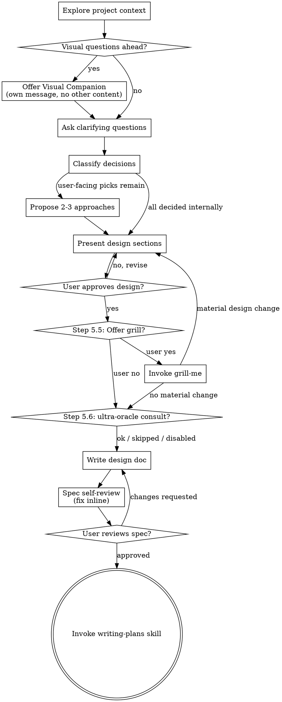

# Brainstorming Ideas Into Designs

Help turn ideas into fully formed designs and specs through natural collaborative dialogue.

Start by understanding the current project context, then ask questions one at a time to refine the idea. Once you understand what you're building, present the design and get user approval.

<HARD-GATE>
Do NOT invoke any implementation skill, write any code, scaffold any project, or take any implementation action until you have presented a design and the user has approved it. This applies to EVERY project regardless of perceived simplicity.
</HARD-GATE>

## Anti-Pattern: "This Is Too Simple To Need A Design"

Every project goes through this process. A todo list, a single-function utility, a config change — all of them. "Simple" projects are where unexamined assumptions cause the most wasted work. The design can be short (a few sentences for truly simple projects), but you MUST present it and get approval.

## Beginner-Mode Loading

At the start of brainstorming (before Step 2 of the Checklist), check active auto-memory for `user`-type entries indicating the user is new to the current domain. The auto-memory protocol is documented in the user's global system prompt — read `MEMORY.md` in the per-project memory directory for the index, then Read referenced `user_*.md` files to detect knowledge-gap signals (descriptions referencing "new to", "learning", "unfamiliar with" combined with a domain keyword relevant to this brainstorming topic). If such an entry exists, OR if the user has used a beginner-mode trigger phrase ("I'm new", "explain like a beginner", "what does X mean", etc.), load `skills/supplements/beginner-mode.md` and apply its discipline through the rest of brainstorming AND any sub-skills it invokes (e.g. grill-me at Step 5.5). The supplement's "Auto-Memory Protocol" section is the canonical reference for read/write/off-ramp specifics — do not duplicate that logic here.

This supplement teaches: gloss domain terms on first use; accept "what does X mean?" interrupts at any time with gloss-and-resume; stop glossing on user request.

## Checklist

You MUST create a task for each of these items and complete them in order:

1. **Explore project context** — check files, docs, recent commits
   - **Step 1.5 (Beginner-mode load, conditional)** — at the start of brainstorming, before Step 2, check auto-memory for `user`-type knowledge-gap entries AND check the user's recent messages for trigger phrases ("I'm new", "explain like a beginner", "what does X mean", etc.). If either fires, load `skills/supplements/beginner-mode.md` and apply it through the rest of brainstorming AND any sub-skills it invokes (e.g. grill-me at Step 5.5). See the `## Beginner-Mode Loading` section below for the full activation protocol.
2. **Offer visual companion** (if topic will involve visual questions) — this is its own message, not combined with a clarifying question. See the Visual Companion section below.
3. **Ask clarifying questions** — one at a time, understand purpose/constraints/success criteria
4. **Classify decisions, then propose approaches** — classify each decision (reversibility × confidence; see "Exploring approaches" below); decide reversible implementation details yourself (any confidence) and recommend defaults for high-confidence low-reversibility decisions; surface only user-facing picks as 2-3 options with trade-offs and your recommendation
5. **Present design** — in sections scaled to their complexity, get user approval after each section
   - **Step 5.5 (Optional Grill, intensifier)** — after design is approved at Step 5 but before Step 6 writes the doc, evaluate signal triggers and offer the user a grill if any fire. See "Step 5.5: Optional Grill" section below.
   - **Step 5.6 (Optional ultra-oracle consult, blocking)** — after the grill (5.5) and before writing the doc (Step 6), if enabled, run a GPT-5.5 Pro design critique. See "Step 5.6: Oracle-Max Consult" section below.
6. **Write design doc** — save to `docs/superpowers/specs/YYYY-MM-DD-<topic>-design.md`. **Do NOT commit yet** — commit happens at Step 8b after the hash is finalized. If a `<!-- GRILL-DECISIONS-BEGIN -->...<!-- GRILL-DECISIONS-END -->` block exists in the conversation, paste the **entire block** (including all four HTML comments — two boundary sentinels `<!-- GRILL-DECISIONS-BEGIN -->` and `<!-- GRILL-DECISIONS-END -->`, plus two metadata comments `<!-- design-hash: ... -->` and `<!-- grill-status: ... -->`) verbatim into the design doc as the "Key Decisions" section, following the block placement contract in `skills/grill-me/SKILL.md`'s Direct-on-disk Sub-case B (blank line before BEGIN, BEGIN on its own line, trailing newline after END). **Leave the `design-hash` line as `sha256:PENDING`** — hash finalization happens at Step 8b (after user review) so any post-paste edits don't leave the stored hash stale.
7. **Spec self-review** — quick inline check for placeholders, contradictions, ambiguity, scope (see below). Apply edits if needed; the design-hash placeholder is still `PENDING` so no recompute required yet.
8. **User reviews written spec** — ask user to review the spec file before proceeding. If user requests revisions, apply them; design-hash is still `PENDING`.
8b. **Finalize design-hash and commit** — if the design doc contains a Key Decisions block, compute the canonical sha256 NOW against the **final** doc body (post-self-review and post-user-review) using the algorithm in `skills/grill-me/SKILL.md`'s "Hash canonicalization algorithm" section — Read that file to get the exact reference Python one-liner and use it verbatim. Replace `sha256:PENDING` with `sha256:<hex>` in the `design-hash` line. Then `git add` + `git commit`. **Invariant:** if any further edit is made to the design doc body after 8b runs (e.g. user requests yet another revision after the commit), repeat 8b — recompute hash + replace + amend or new commit — before considering the design final. The hash MUST always be the last write before the commit it ships in. If no Key Decisions block exists in the doc, this step simplifies to `git add` + `git commit`.
9. **Transition to implementation** — invoke writing-plans skill to create implementation plan

## Process Flow



**The terminal state is invoking writing-plans.** Do NOT invoke frontend-design, mcp-builder, or any other implementation skill. The ONLY skill you invoke after brainstorming is writing-plans.

## The Process

**Understanding the idea:**

- Check out the current project state first (files, docs, recent commits)
- Before asking detailed questions, assess scope: if the request describes multiple independent subsystems (e.g., "build a platform with chat, file storage, billing, and analytics"), flag this immediately. Don't spend questions refining details of a project that needs to be decomposed first.
- If the project is too large for a single spec, help the user decompose into sub-projects: what are the independent pieces, how do they relate, what order should they be built? Then brainstorm the first sub-project through the normal design flow. Each sub-project gets its own spec → plan → implementation cycle.
- For appropriately-scoped projects, ask questions one at a time to refine the idea
- Prefer multiple choice questions when possible, but open-ended is fine too
- Only one question per message - if a topic needs more exploration, break it into multiple questions
- Focus on understanding: purpose, constraints, success criteria

**Exploring approaches — classify, then propose:**

This phase has two steps. First classify each decision; then propose options *only* for the ones that survive as user-facing picks.

**Step 1 — Classify each decision** (use this exact table; reversibility × confidence determines the route):

| Case | Action |
|---|---|
| **Reversible implementation detail** (any confidence) | Decide yourself. State your pick in the proposal as "decided: X, because Y". Reversibility absorbs confidence risk — cost-to-undo is low, so even a 30% confident pick is fine if documented. Do NOT forward as a user-facing question. |
| **Product / risk-appetite decision** (any confidence) | Surface to user as a recommendation-first pick. This is what the user owns. |
| **Low-reversibility decision** (schema / concurrency / security), **confidence <50%** | Invoke `busdriver:council` if available; otherwise propose a small spike (read code, docs lookup). Do NOT force a blind pick. |
| **Low-reversibility decision, confidence 50–70%** | Propose a small spike before deciding. |
| **Low-reversibility decision, confidence ≥70%** | Recommend ONE default with rationale. Flag the risk dimensions (data integrity, migration burden, security, etc.) so the user can veto if their risk appetite differs. Do NOT enumerate raw options — recommend, then accept override. |

**Precedence for mixed-type decisions:** A single decision can match multiple rows (e.g., "which auth provider" is both a product preference AND a low-reversibility security decision). Resolve the technical-risk row FIRST (council/spike/recommend-default per its confidence band), THEN surface the surviving product axis to the user. The low-reversibility rows override the product row when schema/concurrency/security dimensions are present.

User's job: product intent + risk appetite. Your job: reversible technical details + default architecture patterns + recommended-default high-confidence picks on low-reversibility decisions.

**Step 2 — Propose options for the surviving user-facing decisions:**

- Propose 2-3 different approaches with trade-offs
- Present options conversationally with your recommendation and reasoning
- Lead with your recommended option and explain why

**Presenting the design:**

- Once you believe you understand what you're building, present the design
- Scale each section to its complexity: a few sentences if straightforward, up to 200-300 words if nuanced
- Ask after each section whether it looks right so far
- Cover: architecture, components, data flow, error handling, testing
- Be ready to go back and clarify if something doesn't make sense

**Design for isolation and clarity:**

- Break the system into smaller units that each have one clear purpose, communicate through well-defined interfaces, and can be understood and tested independently
- For each unit, you should be able to answer: what does it do, how do you use it, and what does it depend on?
- Can someone understand what a unit does without reading its internals? Can you change the internals without breaking consumers? If not, the boundaries need work.
- Smaller, well-bounded units are also easier for you to work with - you reason better about code you can hold in context at once, and your edits are more reliable when files are focused. When a file grows large, that's often a signal that it's doing too much.

**Working in existing codebases:**

- Explore the current structure before proposing changes. Follow existing patterns.
- Where existing code has problems that affect the work (e.g., a file that's grown too large, unclear boundaries, tangled responsibilities), include targeted improvements as part of the design - the way a good developer improves code they're working in.
- Don't propose unrelated refactoring. Stay focused on what serves the current goal.

## Step 5.5: Optional Grill

After the user approves the design at Step 5, but BEFORE writing the design doc at Step 6, evaluate whether to offer the user a grilling pass.

### When to offer the grill

Offer the grill (with a one-line "yes/no" prompt) if any of these signals are present:

- **Stakes keywords** — design touches: auth, authentication, authorization, payments, billing, schema migration, data deletion, irreversible operations, security boundaries, PII, infra/prod state, external API contracts.
- **Branch count** — design has ≥3 unresolved sub-decisions where reasonable people could disagree (e.g. "we'll figure out X later", "either approach works for Y").
- **Cross-subsystem** — design spans ≥3 subsystems or modules.
- **Explicit user request** — user said "grill me", "stress test this", "interrogate", or similar at any point.

If none of these signals are present, skip the offer and proceed directly to Step 6.

### How to offer

Send a short message:

> "This design touches [stakes keyword / has N unresolved branches / spans M subsystems]. Want me to grill you on it before we write the spec? Grilling walks each load-bearing decision adversarially — about [estimated N] questions."

Wait for the user's response. Treat anything affirmative ("yes", "go", "grill it", "ok") as a yes; anything else as a no.

### On user "yes"

INVOKE `busdriver:grill-me` via the Skill tool. The grill skill will walk the decision tree, then emit a sentinel-bracketed block (`<!-- GRILL-DECISIONS-BEGIN -->...<!-- GRILL-DECISIONS-END -->`) as the final output of its Skill invocation.

**Handoff context:** grill-me sees the full conversation context — the approved verbal design from Step 5, the signal that triggered the offer (which stakes keyword fired or how many unresolved branches were detected), and any open sub-decisions surfaced earlier. No explicit handoff payload is required, since both skills operate in the same conversation. Optionally, brainstorming MAY restate the design in its invocation message for clarity, especially if the conversation has grown long or branched into tangents.

**Continuation:** When the grill-me Skill invocation returns, brainstorming resumes on the next assistant turn and proceeds to Step 6 — or loops back to Step 5 if the design materially changed. The "final output of grill-me" rule does not mean the conversation ends; it means grill-me's last content is the closing block, and the brainstorming flow continues from there.

If the grill produced material design changes (new approach, abandoned constraint, restructured architecture), loop back to Step 5 and re-present the revised design before proceeding to Step 6. If the grill only resolved sub-decisions inside the existing design, proceed to Step 6 directly.

**When looping back to Step 5 due to material design changes:** the prior grill block is now stale — its decisions describe the pre-revision design. Discard it from your conversation context (treat as void). At Step 5.5 on the revised design, either re-run grill-me on the revision (recommended if the user wants stress-testing on the new shape) or skip directly to Step 6 with no Key Decisions section. Do NOT paste the original block — its hash would compute against the revised doc but its decisions wouldn't match.

### On user "no"

Skip the grill and proceed to Step 6. The design doc will not contain a Key Decisions section.

## Step 5.6: Oracle-Max Consult (blocking, opt-in)

After the grill (5.5), before writing the doc (Step 6). Fires only if `ultraOracle.brainstorming.enabled` is true in the operator's **USER config** `~/.claude/busdriver.json` (a repo-controlled project config CANNOT enable it — this prevents a branch from transmitting your design to ChatGPT Pro without your local opt-in), OR the user used a trigger ("consult the oracle"/"ask the oracle"). Skipped silently otherwise.

**Latency:** a GPT-5.5 Pro consult runs minutes (oracle default HTTP timeout 20m, Pro auto-timeout ~60m). This is a deliberate BLOCKING wait; the adapter surfaces oracle's `--heartbeat` progress on the terminal.

**Data boundary:** ultra-oracle transmits the prompt/context (here, the full design) to ChatGPT Pro via the oracle browser engine. If `ultraOracle.chromeProfileDir` is set, oracle clones that Chrome profile (its cookies/session) for a login-free run — point it at a dedicated ChatGPT-only profile, not your main browser. Prefer `ultraOracle.cookiePath` (a signed-in Chrome Cookies DB path) to reuse the session headlessly without cloning the whole profile — the reliable path where Chrome app-bound cookie encryption defeats `--copy-profile`. Do not enable where the design would contain secrets.

Run ONLY when the gate condition holds (Claude evaluates the trigger and runs the block only then). **Write the design text to a file via a SINGLE-QUOTED heredoc and pass `--prompt-file`** — never interpolate design text (which routinely contains backticks, `$(...)`, `$VAR`, quotes) into a double-quoted shell argument:

```bash
source "${BUSDRIVER_PLUGIN_ROOT:-${CLAUDE_PLUGIN_ROOT:-$HOME/.claude/plugins/cache/busdriver/busdriver/current}}/scripts/lib/ultra-oracle.sh"
if ultra_oracle_surface_enabled brainstorming; then
  mkdir -p "${BUSDRIVER_STATE_DIR:-.claude}/ultra-oracle"
  cat > "${BUSDRIVER_STATE_DIR:-.claude}/ultra-oracle/design-critique-prompt.md" <<'ULTRA_ORACLE_EOF'
Critique this approved design adversarially. Name the 3 biggest risks, any simpler alternative, and anything underspecified.

<paste the full approved design text here — the single-quoted ULTRA_ORACLE_EOF marker prevents any backtick/$()/$VAR in the design from executing>
ULTRA_ORACLE_EOF
  status=$(ultra_oracle_consult --mode blocking --slug "ultra oracle design critique" \
    --prompt-file "${BUSDRIVER_STATE_DIR:-.claude}/ultra-oracle/design-critique-prompt.md" \
    --out "${BUSDRIVER_STATE_DIR:-.claude}/ultra-oracle/design-critique.md" || true)
fi
```

(`--prompt-file` is the *adapter's* interface — it reads the file and passes the content to oracle via `--prompt "$(cat ...)"`, since oracle has no `--prompt-file` flag; large files are attached via `--file` to avoid ARG_MAX.)

**Fail CLOSED (never silent):** branch on `$status`:
- `ok` → read the verdict file, fold its critique into the conversation, let the user revise before Step 6.
- `skipped:user` → an operator `skip-ultra-oracle.local` exists; note "ultra-oracle consult skipped (operator opt-out)" and proceed.
- `skipped:unavailable` | `timeout` | `error` → surface verbatim: "⚠ ultra-oracle consult <status> — no verdict produced. Retry / skip-once / abort?" Do NOT proceed to Step 6 until the user picks. Skipping requires an explicit user choice.

## After the Design

**Documentation:**

- Write the validated design (spec) to `docs/superpowers/specs/YYYY-MM-DD-<topic>-design.md`
  - (User preferences for spec location override this default)
- If a `<!-- GRILL-DECISIONS-BEGIN -->...<!-- GRILL-DECISIONS-END -->` block exists in the conversation (emitted by `busdriver:grill-me` at Step 5.5), copy the **entire block** verbatim and **append it at the end of the design doc** as the "Key Decisions" section. **Block placement contract (CRITICAL — same contract used by `skills/grill-me/SKILL.md`'s Direct-on-disk Sub-case B):** (a) ensure a blank line immediately precedes the `<!-- GRILL-DECISIONS-BEGIN -->` sentinel — insert one if existing content does not already end with a blank line; (b) the BEGIN sentinel MUST be the only content on its own line — NEVER share a line with body text, because the hash regex `(?m)^[^\n]*<!-- GRILL-DECISIONS-BEGIN -->` would silently gobble that text into the removed block, dropping it from the hash input and breaking the stale-design check; (c) preserve a single trailing newline after `<!-- GRILL-DECISIONS-END -->`. The pasted region MUST include all four HTML comments (two boundary sentinels `<!-- GRILL-DECISIONS-BEGIN -->` and `<!-- GRILL-DECISIONS-END -->`, plus two metadata comments `<!-- design-hash: ... -->` and `<!-- grill-status: ... -->`) — without them, future grill-me invocations cannot find the block. Find the block in the conversation by exact-string match on `<!-- GRILL-DECISIONS-BEGIN -->` ... `<!-- GRILL-DECISIONS-END -->` — do not synthesize or summarize. **Leave the `design-hash` line as `sha256:PENDING`** — DO NOT compute the hash here. Hash finalization happens at Checklist Step 8b (after user review) so post-paste edits don't leave the stored hash stale. If no block exists in the conversation, omit the Key Decisions section entirely.
- Use elements-of-style:writing-clearly-and-concisely skill if available
- Commit the design document to git — if a Key Decisions block is present, do NOT commit here; hash finalization and commit happen at Checklist Step 8b. If no Key Decisions block exists, `git add` + `git commit` now.

**Spec Self-Review:**
After writing the spec document, look at it with fresh eyes:

1. **Placeholder scan:** Any "TBD", "TODO", incomplete sections, or vague requirements? Fix them.
2. **Internal consistency:** Do any sections contradict each other? Does the architecture match the feature descriptions?
3. **Scope check:** Is this focused enough for a single implementation plan, or does it need decomposition?
4. **Ambiguity check:** Could any requirement be interpreted two different ways? If so, pick one and make it explicit.

Fix any issues inline. No need to re-review — just fix and move on.

**User Review Gate:**
After the spec review loop passes, ask the user to review the written spec before proceeding:

> "Spec written and committed to `<path>`. Please review it and let me know if you want to make any changes before we start writing out the implementation plan."

Wait for the user's response. If they request changes, make them and re-run the spec review loop. Only proceed once the user approves.

**Implementation:**

- Invoke the writing-plans skill to create a detailed implementation plan
- Do NOT invoke any other skill. writing-plans is the next step.

## Key Principles

- **One question at a time** - Don't overwhelm with multiple questions
- **Multiple choice preferred** - Easier to answer than open-ended when possible
- **YAGNI ruthlessly** - Remove unnecessary features from all designs
- **Explore alternatives** - Always propose 2-3 approaches before settling
- **Incremental validation** - Present design, get approval before moving on
- **Be flexible** - Go back and clarify when something doesn't make sense

## Visual Companion

A browser-based companion for showing mockups, diagrams, and visual options during brainstorming. Available as a tool — not a mode. Accepting the companion means it's available for questions that benefit from visual treatment; it does NOT mean every question goes through the browser.

**Offering the companion:** When you anticipate that upcoming questions will involve visual content (mockups, layouts, diagrams), offer it once for consent:
> "Some of what we're working on might be easier to explain if I can show it to you in a web browser. I can put together mockups, diagrams, comparisons, and other visuals as we go. This feature is still new and can be token-intensive. Want to try it? (Requires opening a local URL)"

**This offer MUST be its own message.** Do not combine it with clarifying questions, context summaries, or any other content. The message should contain ONLY the offer above and nothing else. Wait for the user's response before continuing. If they decline, proceed with text-only brainstorming.

**Per-question decision:** Even after the user accepts, decide FOR EACH QUESTION whether to use the browser or the terminal. The test: **would the user understand this better by seeing it than reading it?**

- **Use the browser** for content that IS visual — mockups, wireframes, layout comparisons, architecture diagrams, side-by-side visual designs
- **Use the terminal** for content that is text — requirements questions, conceptual choices, tradeoff lists, A/B/C/D text options, scope decisions

A question about a UI topic is not automatically a visual question. "What does personality mean in this context?" is a conceptual question — use the terminal. "Which wizard layout works better?" is a visual question — use the browser.

If they agree to the companion, read the detailed guide before proceeding:
`skills/brainstorming/visual-companion.md`
