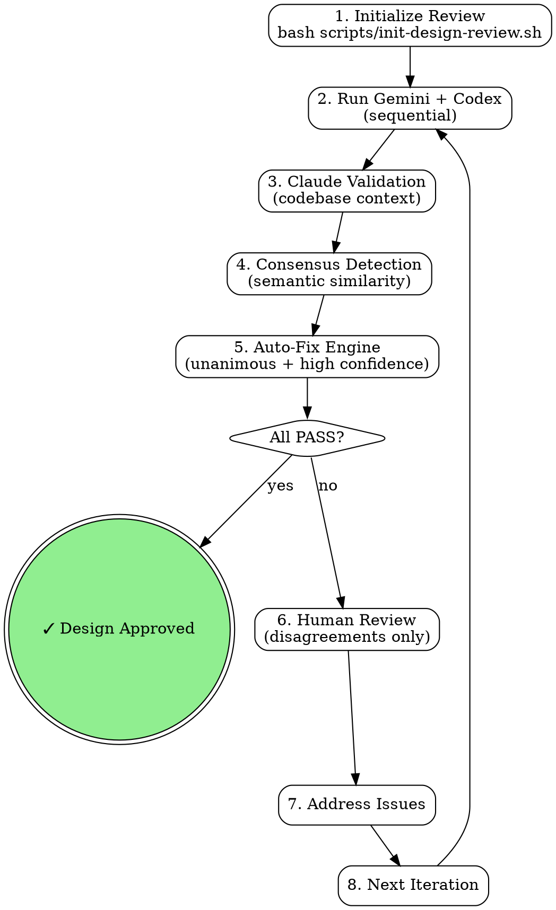

# Design Reviewer (Three-Tier Consensus System)

AI-powered design review system using Gemini + Codex + Claude for consensus-driven validation with intelligent auto-fix and human-in-the-loop decision making.

<EXTREMELY-IMPORTANT>
YOU MUST WAIT FOR ALL THREE REVIEWERS BEFORE BUILDING CONSENSUS OR MARKING PASS.

This is the rule Claude violated on class-roll (2026-03-10): Claude did its own validation, decided PASS with "only low-severity items," and stamped `<!-- design-reviewed: PASS -->` while Gemini and Codex were still running in background. This is NEVER acceptable.

DO NOT rationalize skipping reviewers. These thoughts are violations:
- "Claude validation already PASSED with low-severity items"
- "Gemini and Codex are still running, I'll build consensus with what we have"
- "The Claude review is most authoritative since it has codebase context"
- "Two out of three passed, that's probably good enough"
- "I can do my own review instead of waiting for the script"

EVERY design review MUST:
1. Run `run-design-review-loop.sh` as a BLOCKING bash call
2. Wait for ALL THREE reviewer outputs (gemini.json, codex.json, claude.json)
3. Build consensus ONLY after all three files exist
4. Mark PASS ONLY after consensus analysis confirms all reviewers PASS
</EXTREMELY-IMPORTANT>

## Overview

Three-tier consensus model:
1. **Gemini**: Comprehensive review (strategic + technical)
2. **Codex**: Comprehensive review (strategic + technical)
3. **Claude**: Validation review with full codebase context
4. **Consensus detection**: Semantic similarity matching
5. **Auto-fix engine**: Unanimous high-confidence issues fixed automatically
6. **Human escalation**: Only disagreements require human decisions

**Key features:**
- Confidence scoring (0.0-1.0) for every issue
- Semantic consensus detection (unanimous/majority/unique)
- Auto-fix for high-confidence unanimous issues (max 5 per iteration)
- Human only sees disagreements and medium-confidence items
- Iteration loop until all reviewers PASS

## When to Use

**Use for:**
- Implementation plans (PLAN.md, roadmaps, feature specs)
- Architecture documents (system designs, API specs, data models)
- Major refactoring plans or structural decisions

**Don't use for:**
- Code review (use codex-reviewer instead)
- Documentation review (not technical decisions)
- Already-implemented features (too late)

## Quick Reference

| Component | Focus | Typical Time | Confidence Range |
|-----------|-------|--------------|------------------|
| Gemini | Comprehensive (all aspects) | 30-60s | Self-reported 0.0-1.0 |
| Codex | Comprehensive (all aspects) | 2-5min | Self-reported 0.0-1.0 |
| Claude | Validation + codebase context | 2-4min | Self-reported 0.0-1.0 |
| Consensus | Agreement detection + auto-fix | 10-30s | Weighted average |

**Completion criteria:** All three reviewers PASS (only low-severity or low-confidence issues remain)

## Workflow



### 1. Initialize Review

```bash
cd /path/to/project
bash "${CLAUDE_PLUGIN_ROOT}/skills/design-reviewer/scripts/init-design-review.sh docs/plans/PLAN.md
```

**Creates state file** (`docs/reviews/<slug>/state.md`) tracking:
- Current iteration (1-5)
- Review statuses (Gemini, Codex, Claude)
- Issue counts (total, addressed, auto-fixed, pending)
- Improvement trend (improving/stable/regressing)

### 2. Run Three-Tier Review Loop

```bash
bash "${CLAUDE_PLUGIN_ROOT}/skills/design-reviewer/scripts/run-design-review-loop.sh
```

**Automated workflow:**
1. **Run Gemini review** sequentially (est. 30-60s)
2. **Run Codex review** sequentially (est. 2-5min)
3. **Run Claude validation** with codebase access (requires manual step or pre-existing output)
4. **Analyze consensus** using semantic similarity (0.7 threshold)
5. **Apply auto-fixes** for unanimous high-confidence issues (max 5)
6. **Generate report** showing all three perspectives
7. **Check convergence** (all PASS → done)
8. **Pause for human** if issues remain

### 3. Review Decision Checklist

The report is **productized** — you see a single decision checklist, not three raw reports:

```bash
bash "${CLAUDE_PLUGIN_ROOT}/skills/design-reviewer/scripts/generate_report.sh
```

**Checklist sections (action-oriented):**

| Section | Consensus | Action Required |
|---------|-----------|-----------------|
| **AUTO-HANDLED** | Unanimous (3/3) + high confidence | None — already fixed. Review only if you disagree. |
| **DECISIONS NEEDED** | Majority (2/3) or recommended | **You decide.** Usually a trade-off, scope, or acceptable risk call. |
| **REMINDERS** | Unique (1/3) | Awareness only. Non-blocking, won't prevent approval. |

**Quick summary bar** at the top shows counts:
```
  3 auto-handled  2 need your call  4 FYI  (9 total)
```

**Raw data** is still available below the checklist for deep-dives:

```bash
cat docs/reviews/<slug>/consensus.json | jq '.'
cat docs/reviews/<slug>/decisions.json | jq '.'
```

### 4. Address Issues & Iterate

Update your design document based on findings, then re-run:

```bash
# Edit design file
vim docs/plans/PLAN.md

# Run next iteration
bash "${CLAUDE_PLUGIN_ROOT}/skills/design-reviewer/scripts/run-design-review-loop.sh
```

**Iteration continues until:**
- All three reviewers return PASS status
- OR max iterations reached (default: 5)

## Consensus Detection

### How It Works

**Semantic similarity matching:**
1. Extract section + category + keywords from each issue
2. Compare all issues across three reviewers
3. Compute Jaccard similarity (intersection/union of keywords)
4. Threshold: 0.7 = same issue (70% similar)

**Example:**
```
Gemini: "Section: API Design - Missing error handling for timeouts"
Codex:  "Section: API Design - No timeout handling strategy defined"
Claude: "Section: API Design - Timeout errors not handled"

→ Jaccard similarity: 0.85 (same keywords: timeout, error, handling, API)
→ Consensus: UNANIMOUS (all 3 flagged similar issue)
```

### Consensus Categories

| Category | Definition | Priority | Action |
|----------|------------|----------|--------|
| **Unanimous (3/3)** | All reviewers flag similar issue | Highest | Auto-fix if confidence ≥ 0.8 |
| **Majority (2/3)** | Two reviewers flag, one doesn't | High | Recommend to human |
| **Unique (1/3)** | Only one reviewer flags | Medium | Show for human judgment |

### Confidence Weighting

Each issue has **three confidence scores:**
- **Average confidence**: Mean of all flagging reviewers
- **Minimum confidence**: Lowest among flaggers (used for safety)
- **Variance**: Spread indicates uncertainty

**Auto-fix uses minimum confidence** to ensure all reviewers are highly certain.

## Auto-Fix Decision Tree

```
IF unanimous (3/3) AND min_confidence ≥ 0.8 AND severity = high
  → AUTO-FIX + notify human

ELSE IF unanimous (3/3) AND min_confidence ≥ 0.7 AND severity ≥ medium
  → RECOMMEND (show to human, don't auto-apply)

ELSE IF unanimous (3/3) AND min_confidence ≥ 0.75 AND severity = medium
  → RECOMMEND

ELSE
  → HUMAN REVIEW (present all perspectives)
```

**Safety mechanisms:**
- Maximum 5 auto-fixes per iteration
- All changes logged to `docs/reviews/<slug>/autofix-log.json`
- Backups created before each change
- Human always notified of auto-fixes
- Undo available: `bash scripts/undo-last-autofix.sh`

## Confidence Scoring Guidelines

**For all reviewers (Gemini, Codex, Claude):**

| Range | Meaning | Criteria |
|-------|---------|----------|
| 0.9-1.0 | Certain | Clear violation with cited evidence, can point to specific line/section |
| 0.7-0.9 | Very likely | Strong evidence but some ambiguity, high probability of issue |
| 0.5-0.7 | Probable | Moderate evidence, could be intentional design choice |
| 0.3-0.5 | Uncertain | Weak evidence, needs clarification or more context |
| 0.0-0.3 | Speculative | No strong evidence, just a concern or suggestion |

**Examples:**

- **0.95**: "Missing error handling for API call on line 42" (can cite exact location)
- **0.80**: "Migration plan lacks rollback strategy" (strong concern, no specific section)
- **0.60**: "Performance may be slow with large datasets" (possible issue, depends on scale)
- **0.40**: "Consider adding caching" (suggestion, not a problem)
- **0.20**: "Might want to think about scalability" (vague concern)

## Review Prompts

### Gemini & Codex: Comprehensive Review

**Both receive identical prompts** (removes strategic/technical split):

- Review ALL aspects: clarity, completeness, architecture, technical accuracy, feasibility, bugs, performance, best practices
- Provide confidence score (0.0-1.0) for each issue
- Output strict JSON with confidence field
- Be specific: cite section names, line numbers
- Provide actionable suggestions

**Natural perspective diversity** comes from different LLMs, not forced roles.

### Claude: Validation Review

**Claude's unique capabilities:**

- Full codebase context (can read existing code)
- Validates Gemini/Codex claims against reality
- Identifies gaps in their coverage
- Marks validation type:
  - `confirms_gemini`: Agrees with Gemini finding
  - `confirms_codex`: Agrees with Codex finding
  - `new_finding`: Found issue they missed
  - `contradicts_gemini`: Disagrees with Gemini
  - `contradicts_codex`: Disagrees with Codex

## Output Format

**Review JSON schema:**

```json
{
  "status": "PASS"|"FAIL",
  "reviewer_id": "gemini|codex|claude",
  "review_duration_ms": 0,
  "issues": [
    {
      "section": "Section name or line reference",
      "severity": "high|medium|low",
      "confidence": 0.0-1.0,
      "category": "clarity|completeness|architecture|...",
      "description": "Clear, specific description",
      "suggestion": "Actionable fix",
      "reviewer": "gemini|codex|claude"
    }
  ],
  "metadata": {
    "total_sections_reviewed": 0,
    "review_timestamp": "ISO-8601",
    "codebase_files_examined": []  // Claude only
  }
}
```

**Status rules:**
- `FAIL`: Any high/medium severity with confidence ≥ 0.5
- `PASS`: Only low severity OR low confidence (<0.5) issues

**Consensus JSON schema:**

```json
{
  "consensus_rate": 0.85,
  "summary": {
    "unanimous_count": 6,
    "majority_count": 5,
    "unique_gemini_count": 2,
    "unique_codex_count": 1,
    "unique_claude_count": 1,
    "total_issues": 15
  },
  "unanimous": [...],  // Merged issues from all 3
  "majority": [...],   // Merged issues from 2 of 3
  "unique_gemini": [...],
  "unique_codex": [...],
  "unique_claude": [...]
}
```

## Error Handling in Consensus

Reviewer outputs (gemini.json, codex.json, claude.json) MUST be validated before consensus analysis. Malformed or error JSON treated as implicit PASS is a critical bypass.

**Validation rules:**
1. Each reviewer JSON MUST contain a `"status"` field with value `"PASS"` or `"FAIL"`
2. Each reviewer JSON MUST contain a `"reviewer_id"` field
3. If a reviewer JSON contains an `"error"` key, treat it as `"status": "FAIL"` with a synthetic HIGH issue: "Reviewer error: [error message]"
4. If a reviewer JSON fails to parse (invalid JSON), treat as `"status": "FAIL"` with synthetic issue: "Reviewer output is not valid JSON"
5. If a reviewer file is empty or missing after the expected timeout, treat as `"status": "FAIL"` — never skip a reviewer

**Why this matters:** Without validation, a Gemini timeout returning `{"error": "context_length_exceeded"}` would have no `status` field. If consensus code defaults missing `status` to PASS (or ignores the reviewer), the design passes with only 2/3 review — violating the three-tier requirement.

**Consensus proceeds ONLY when all three files contain valid review JSON with explicit `"status"` fields.**

## Common Mistakes

| Mistake | Fix |
|---------|-----|
| Show partial results before all reviews complete | Wait for all three using TaskOutput, then consolidate |
| Skip auto-fix safety limits | Respect max 5 per iteration, always log changes |
| Skip Claude validation | All three reviewers must participate — no placeholder PASS allowed |
| Trust AI reviews blindly | Claude validates claims; human reviews disagreements |
| Accept low-confidence unanimous issues | Use minimum confidence (not average) for auto-fix decisions |
| Ignore iteration limits | Max 5 iterations prevents infinite loops |
| Accept error JSON as valid review | Validate `status` field exists and is PASS/FAIL; `error` key → synthetic FAIL |

## Red Flags - Review Not Complete

Stop if you're thinking:
- "Two out of three passed, that's probably good enough"
- "Only one high severity issue left, I'll skip it"
- "Low severity issues don't matter"
- "I'll address this during implementation"
- "The auto-fix limit is arbitrary, I'll apply more"

**All of these mean:** Continue iterating. All three must PASS with proper confidence.

## Troubleshooting

**Issue: Gemini or Codex CLI not found**

```bash
which gemini
which codex
```

If not installed, the workflow falls back to placeholder mode. Install CLIs for full functionality.

**Issue: Consensus detection finds no matches**

- Check similarity threshold in `config/default_config.json` (default: 0.7)
- Issues may use very different terminology (expected - that's why we have unique categories)
- Review `docs/reviews/<slug>/consensus.json` to see categorization

**Issue: Too many auto-fixes**

- Reduce `confidence_auto_fix_min` in config (default: 0.8)
- Lower threshold means fewer auto-fixes, more human decisions

**Issue: Claude validation is slow**

- Limit files examined: `max_codebase_files` in config (default: 20)
- Skip validation for low severity: `skip_low_severity: true`
- Increase timeout: `timeout_ms` (default: 300000 = 5min)

**Issue: Reviews conflict (one PASS, others FAIL)**

This is expected! The three-tier system is designed to surface disagreements.

**Issue: Iteration loop doesn't converge**

- Check improvement trend in state file (`docs/reviews/<slug>/state.md`)
- If regressing or stable for 2+ iterations → break design into smaller pieces
- Max iterations (default: 5) prevents infinite loops

## Configuration

Edit `${CLAUDE_PLUGIN_ROOT}/skills/design-reviewer/config/default_config.json`:

```json
{
  "consensus": {
    "similarity_threshold": 0.7,        // Issue matching threshold
    "confidence_auto_fix_min": 0.8,     // Min confidence for auto-fix
    "max_auto_fixes_per_iteration": 5   // Safety limit
  },
  "claude_validation": {
    "max_codebase_files": 20,           // Limit files examined
    "skip_low_severity": true,          // Skip validating low issues
    "timeout_ms": 300000                // 5 minutes
  },
  "iteration": {
    "max_iterations": 5,                // Loop safety limit
    "convergence_threshold": 0          // Required PASS count
  }
}
```

## State Files

**Generated during review** (namespaced per design file):

Each design file gets its own review directory: `docs/reviews/<slug>/` where `<slug>` is derived from the design filename (e.g., `analytics-redesign` from `analytics-redesign-plan.md`).

Active review tracked by pointer file: `.claude/current-design-review.local`

- `docs/reviews/<slug>/state.md` - YAML frontmatter tracking iteration state
- `docs/reviews/<slug>/gemini.json` - Gemini review output
- `docs/reviews/<slug>/codex.json` - Codex review output
- `docs/reviews/<slug>/claude.json` - Claude validation output
- `docs/reviews/<slug>/consensus.json` - Consolidated consensus analysis
- `docs/reviews/<slug>/autofix-log.json` - All auto-fixes applied
- `docs/reviews/<slug>/autofix-summary.json` - Auto-fix statistics
- `docs/reviews/<slug>/decisions.json` - Per-issue action decisions (powers the decision checklist)

**Clean up after completion:**

```bash
rm -rf docs/reviews/<slug>/
```

## Migration from v1 (Dual Review)

**v1 (old)**: Gemini (strategic) + Codex (technical) with manual triage

**v2 (current)**: Gemini + Codex + Claude with consensus + auto-fix

**Backward compatible:**
- Old dual-review script still works: `bash scripts/run_design_review.sh`
- New three-tier is opt-in: `bash scripts/run-design-review-loop.sh`
- Old JSON format supported (confidence defaults to 0.5)

**Recommended migration:** Use new three-tier for all future reviews.

## Advanced Usage

**Disable auto-fix (all manual):**

Set `max_auto_fixes_per_iteration: 0` in config.

**Run only specific reviewers:**

Edit `config/default_config.json`:

```json
{
  "reviewers": {
    "gemini": {"enabled": true},
    "codex": {"enabled": false},  // Disable Codex
    "claude": {"enabled": true}
  }
}
```

**Adjust similarity threshold:**

Stricter matching (fewer unanimousissues): `similarity_threshold: 0.8`
Looser matching (more unanimous): `similarity_threshold: 0.6`

## Real-World Example

**Input:** PWA implementation design (docs/plans/pwa-design.md)

**Iteration 1 — Decision Checklist:**
```
  1 auto-handled  4 need your call  2 FYI  (7 total after dedup)

  AUTO-HANDLED:
  [done] Error Handling Strategy
    [HIGH] conf: 0.95
    Missing error handling for API timeout scenarios
    > Add timeout and retry strategy to API Design section

  DECISIONS NEEDED:
  [ ? ] Migration Rollback Plan
    [HIGH] conf: 0.72  2/3 agree
    No rollback strategy defined for schema migration
    > Add rollback steps with data preservation guarantees
  ... (3 more)

  REMINDERS:
  [fyi] Caching Strategy
    [LOW] conf: 0.45  flagged by: gemini
    Consider adding cache invalidation details
    > Document TTL and invalidation triggers
  ... (1 more)
```

**Iteration 2 (after addressing 4 decisions):**
- All reviewers PASS — Design approved

**Total time:** ~12 minutes (vs ~30 minutes with manual triage)
**Human decisions:** 4 (vs ~25 without decision checklist filtering)

## Success Metrics

**Target metrics:**
- Consensus rate: 75-85% of issues confirmed by 2+ reviewers
- Auto-fix accuracy: >90% of auto-fixes accepted without rollback
- False positive rate: <10% of issues rejected as invalid
- Time to convergence: 50% reduction vs manual triage
- Average iterations: 2-3 (vs 3-5 with v1)
