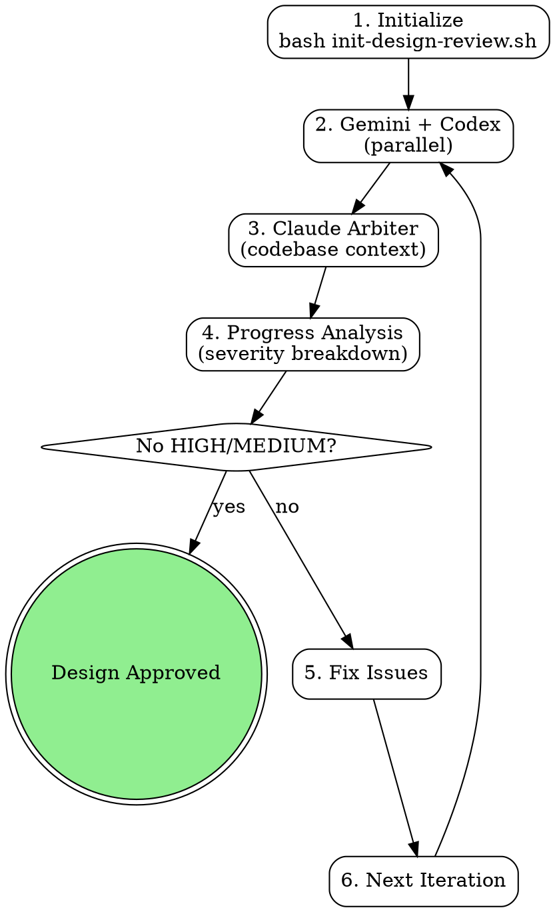

# Design Reviewer (Three-Tier, Claude Arbiter)

AI-powered design review using Gemini + Codex (parallel) with Claude as the arbiter.

<EXTREMELY-IMPORTANT>
YOU MUST WAIT FOR ALL THREE REVIEWERS BEFORE MARKING PASS.

This is the rule Claude violated on class-roll (2026-03-10): Claude did its own validation, decided PASS with "only low-severity items," and stamped `<!-- design-reviewed: PASS -->` while Gemini and Codex were still running in background. This is NEVER acceptable.

DO NOT rationalize skipping reviewers. These thoughts are violations:
- "Claude validation already PASSED with low-severity items"
- "Gemini and Codex are still running, I'll build consensus with what we have"
- "The Claude review is most authoritative since it has codebase context"
- "Two out of three passed, that's probably good enough"
- "I can do my own review instead of waiting for the script"

EVERY design review MUST:
1. Run `run-design-review-loop.sh` as a BLOCKING bash call
2. Wait for ALL THREE reviewer outputs (gemini.json, codex.json, claude.json)
3. Claude validates Gemini/Codex findings against the codebase
4. Mark PASS ONLY when Claude's verdict has no HIGH/MEDIUM issues (confidence >= 0.5)
</EXTREMELY-IMPORTANT>

## Overview

Three-tier model with Claude as arbiter:
1. **Gemini + Codex**: Run in parallel as independent comprehensive reviewers
2. **Claude**: Validates their findings against the codebase (arbiter)
3. **Claude's verdict**: The sole convergence signal

**Key features:**
- Parallel execution (Gemini + Codex run simultaneously)
- Run-scoped artifact isolation (stale outputs cleaned per iteration)
- Hard freshness contract (run_id + spec_hash in every output)
- Atomic writes (.pending → rename on success)
- Explicit progress model (severity breakdown, not binary FAIL/PASS)

## When to Use

**Use for:**
- Implementation plans (PLAN.md, roadmaps, feature specs)
- Architecture documents (system designs, API specs, data models)
- Major refactoring plans or structural decisions

**Don't use for:**
- Code review (use codex-reviewer instead)
- Documentation review (not technical decisions)
- Already-implemented features (too late)

## Quick Reference

| Component | Focus | Typical Time |
|-----------|-------|--------------|
| Gemini | Comprehensive (all aspects) | 1-5min |
| Codex | Comprehensive (all aspects) | 1-5min |
| Gemini + Codex total | Parallel execution | 1-5min (wall clock) |
| Claude | Arbiter + codebase validation | 2-5min |

**Completion criteria:** Claude's verdict has no HIGH or MEDIUM severity issues with confidence >= 0.5

## Workflow



### 1. Initialize Review

```bash
cd /path/to/project
bash "${CLAUDE_PLUGIN_ROOT}/skills/design-reviewer/scripts/init-design-review.sh" docs/plans/PLAN.md
```

**Creates state file** (`docs/reviews/<slug>/state.md`) tracking:
- Current iteration (1-5)
- Review statuses (Gemini, Codex, Claude)
- Progress model (high/medium/low issue counts)

### 2. Run Review Loop

```bash
bash "${CLAUDE_PLUGIN_ROOT}/skills/design-reviewer/scripts/run-design-review-loop.sh"
```

**Automated workflow:**
1. **Clean stale artifacts** from previous iteration
2. **Run Gemini + Codex in parallel** (background processes, `wait` for both)
3. **Validate outputs** (JSON integrity + freshness contract)
4. **Claude validation** with codebase access (manual step or pre-existing output)
5. **Progress analysis** (severity breakdown from Claude's verdict)
6. **Convergence check** (no HIGH/MEDIUM with confidence >= 0.5 → PASS)

### 3. Address Issues & Iterate

Update your design document based on Claude's findings, then re-run:

```bash
# Edit design file
vim docs/plans/PLAN.md

# Run next iteration
bash "${CLAUDE_PLUGIN_ROOT}/skills/design-reviewer/scripts/run-design-review-loop.sh"
```

**Iteration continues until:**
- Claude's verdict has no HIGH/MEDIUM issues (confidence >= 0.5)
- OR max iterations reached (default: 5)

## Architecture: Claude as Arbiter

### Why Not Mechanical Consensus?

The original system used Jaccard keyword similarity to match issues across reviewers.
It achieved **0% match rate** across 5 iterations because reviewers use different naming conventions.
Claude's manual cross-referencing was doing all the real consensus work.

**New model:** Claude IS the consensus mechanism. Gemini and Codex provide independent perspectives;
Claude validates them against the codebase and renders a verdict.

### Freshness Contract

Every reviewer output includes metadata for provenance tracking:

```json
{
  "metadata": {
    "run_id": "a1b2c3d4",
    "iteration": 2,
    "spec_hash": "sha256-of-design-file",
    "review_duration_ms": 120000
  }
}
```

The script validates that all outputs share the same `run_id` before proceeding.
Stale outputs from previous runs are rejected (fail-closed).

### Progress Model

Replaces binary FAIL/PASS with explicit severity breakdown:

| Status | Meaning | Action |
|--------|---------|--------|
| `blocked_by_high_issues` | HIGH severity issues remain | Must fix before proceeding |
| `medium_issues_remaining` | MEDIUM severity issues remain | Should fix before proceeding |
| `low_issues_only` | Only LOW severity issues | PASS — proceed to implementation |
| `passed` | No issues | PASS — proceed to implementation |

Progress is visible across iterations: "iteration 1: 6 high → iteration 2: 2 high → iteration 3: 0 high, 1 medium"

## Claude Validation

**Claude's unique role as arbiter:**

- Full codebase context (can read existing code)
- Validates Gemini/Codex claims against reality
- Identifies gaps in their coverage
- Renders the final verdict

**Validation types:**
- `confirms_gemini`: Agrees with Gemini finding
- `confirms_codex`: Agrees with Codex finding
- `new_finding`: Found issue they missed
- `contradicts_gemini`: Disagrees with Gemini
- `contradicts_codex`: Disagrees with Codex

## Output Format

**Review JSON schema:**

```json
{
  "status": "PASS"|"FAIL",
  "reviewer_id": "gemini|codex|claude",
  "review_duration_ms": 0,
  "issues": [
    {
      "section": "Section name or line reference",
      "severity": "high|medium|low",
      "confidence": 0.0-1.0,
      "category": "clarity|completeness|architecture|...",
      "description": "Clear, specific description",
      "suggestion": "Actionable fix",
      "reviewer": "gemini|codex|claude"
    }
  ],
  "metadata": {
    "run_id": "a1b2c3d4",
    "iteration": 1,
    "spec_hash": "sha256...",
    "total_sections_reviewed": 0,
    "review_timestamp": "ISO-8601",
    "codebase_files_examined": []
  }
}
```

**Status rules:**
- `FAIL`: Any high/medium severity with confidence >= 0.5
- `PASS`: Only low severity OR low confidence (<0.5) issues

## Error Handling

Reviewer outputs MUST be validated before Claude arbitration. Malformed or error JSON treated as implicit PASS is a critical bypass.

**Validation rules:**
1. Each reviewer JSON MUST contain a `"status"` field with value `"PASS"` or `"FAIL"`
2. Each reviewer JSON MUST contain a `"reviewer_id"` field
3. If a reviewer JSON contains an `"error"` key, treat as `"status": "FAIL"`
4. If a reviewer JSON fails to parse, treat as `"status": "FAIL"`
5. If a reviewer file is missing after timeout, treat as `"status": "FAIL"` — never skip
6. If `run_id` doesn't match current run, treat as stale — reject (fail-closed)

## Common Mistakes

| Mistake | Fix |
|---------|-----|
| Show partial results before all reviews complete | Wait for all three outputs, then proceed |
| Skip Claude validation | Claude is the arbiter — skipping it removes the convergence signal |
| Trust external reviews blindly | Claude validates claims against the codebase |
| Ignore iteration limits | Max 5 iterations prevents infinite loops |
| Accept error JSON as valid review | Validate `status` field; `error` key → synthetic FAIL |
| Read stale outputs from previous run | Script cleans artifacts at iteration start + validates run_id |

## Troubleshooting

**Issue: Gemini or Codex CLI not found**

```bash
which gemini
which codex
```

If not installed, the workflow uses error fallback. Install CLIs for full review coverage.

**Issue: Claude validation is slow**

Claude needs codebase access for validation. In auto mode, the calling skill must complete Claude validation before the script checks for output.

**Issue: Iteration loop doesn't converge**

- Check progress in state file: `cat docs/reviews/<slug>/state.md`
- Look at severity breakdown: is it improving? (6 high → 2 high → 0 high)
- If stuck, break design into smaller pieces
- Max iterations (default: 5) prevents infinite loops

**Issue: Stale output detected**

The script validates `run_id` on every output. If you see "STALE OUTPUT DETECTED", a file from a previous run was not cleaned up. The script handles this automatically by replacing with an error JSON.

## State Files

Each design file gets its own review directory: `docs/reviews/<slug>/`

Active review tracked by pointer file: `.claude/current-design-review.local`

- `docs/reviews/<slug>/state.md` - YAML frontmatter tracking iteration + progress
- `docs/reviews/<slug>/gemini.json` - Gemini review output (with freshness metadata)
- `docs/reviews/<slug>/codex.json` - Codex review output (with freshness metadata)
- `docs/reviews/<slug>/claude.json` - Claude arbiter output (with freshness metadata)
- `docs/reviews/<slug>/claude-validation-prompt.txt` - Generated prompt for Claude

**Clean up after completion:**

```bash
rm -rf docs/reviews/<slug>/
```

## Confidence Scoring Guidelines

| Range | Meaning | Criteria |
|-------|---------|----------|
| 0.9-1.0 | Certain | Clear violation with cited evidence |
| 0.7-0.9 | Very likely | Strong evidence but some ambiguity |
| 0.5-0.7 | Probable | Moderate evidence, could be design choice |
| 0.3-0.5 | Uncertain | Weak evidence, needs clarification |
| 0.0-0.3 | Speculative | No strong evidence, just a concern |

## Version History

**v3 (current, 2026-03-27):** Claude-as-arbiter model. Parallel Gemini+Codex. Run-scoped isolation. Freshness contracts. Atomic writes. Explicit progress model. Deleted broken Jaccard consensus, auto-fix engine, and report generator.

**v2:** Three-tier with Jaccard consensus + auto-fix. Achieved 0% consensus match rate. Claude's manual cross-referencing did all real work.

**v1:** Gemini (strategic) + Codex (technical) with manual triage.
